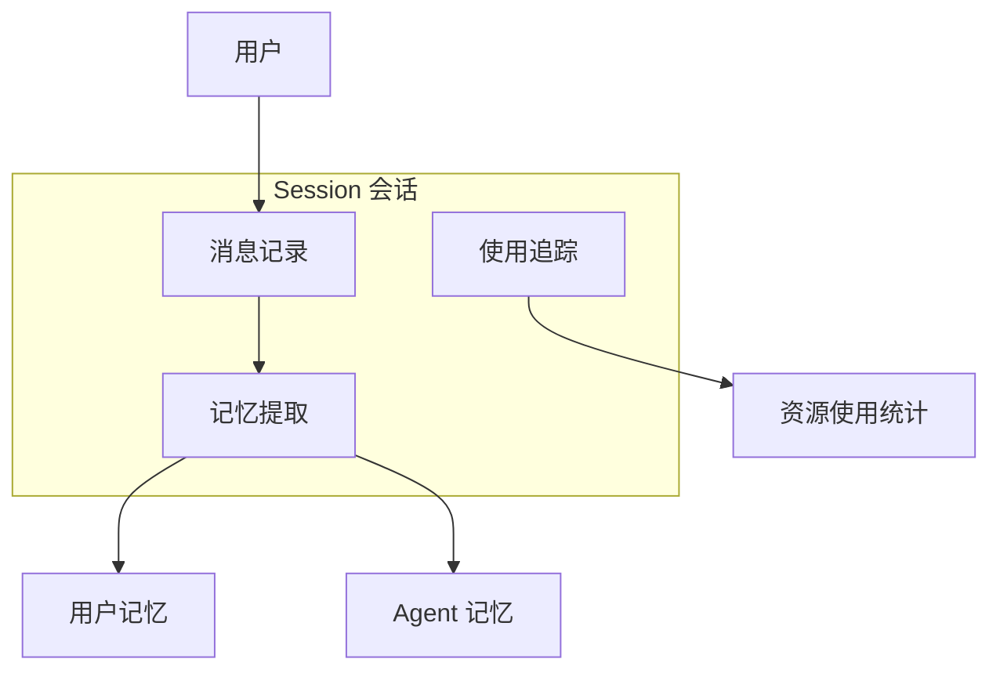
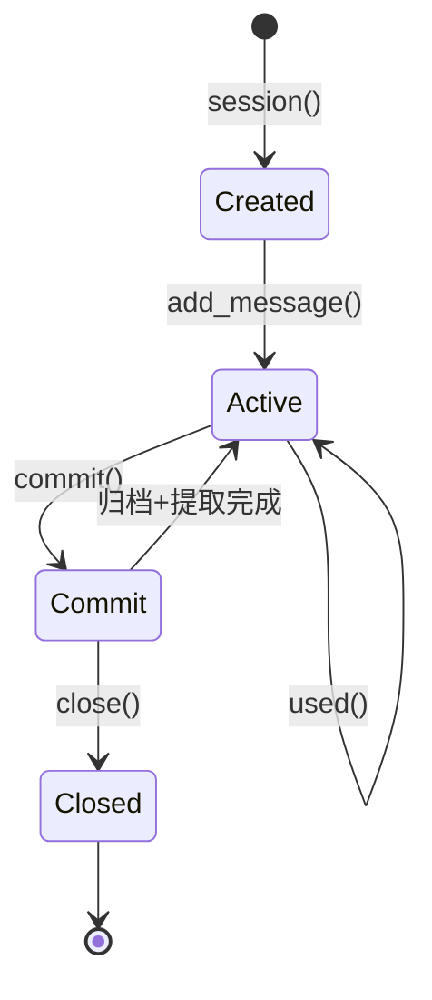
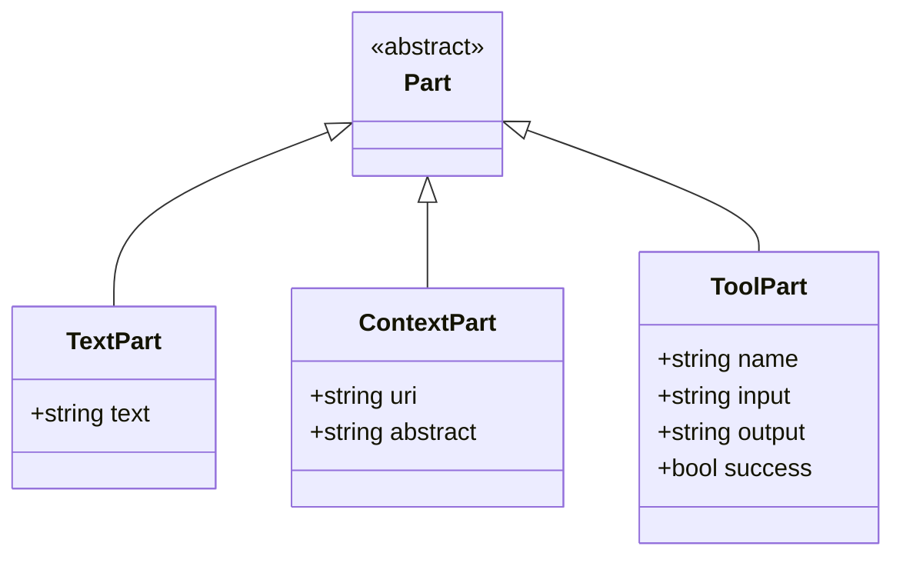
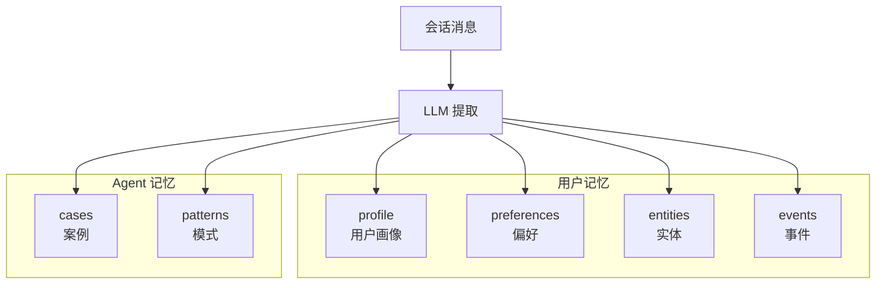
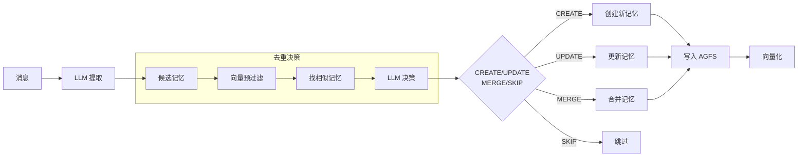
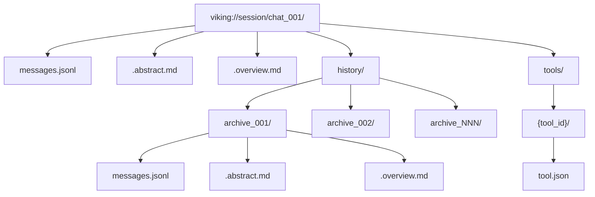
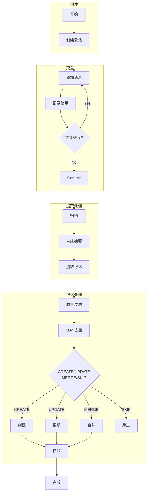
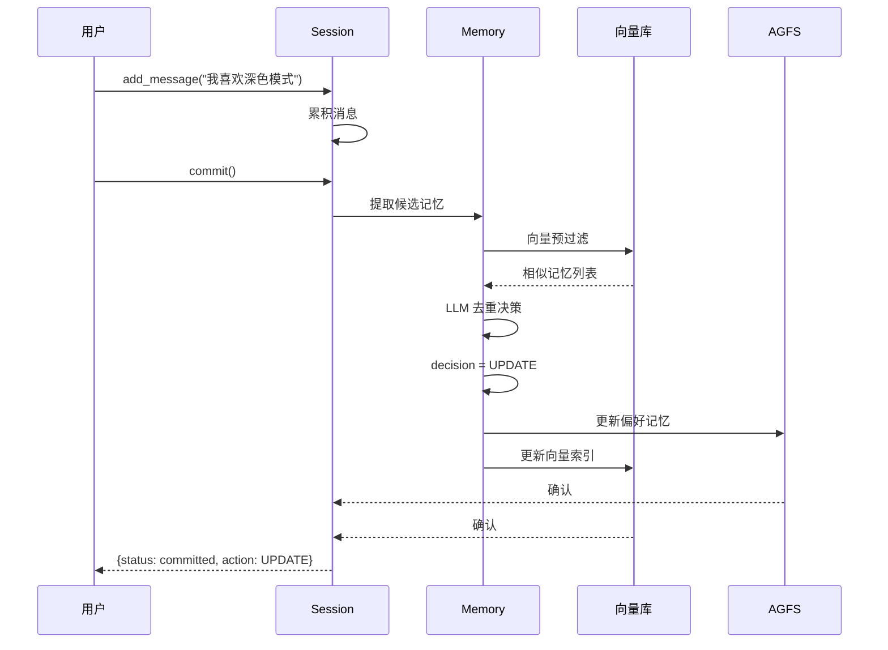

# OpenViking 会话管理详解

> 管理对话消息、记录上下文使用、提取长期记忆

## 目录

1. [会话概述](#1-会话概述)
2. [会话生命周期](#2-会话生命周期)
3. [消息结构](#3-消息结构)
4. [压缩策略](#4-压缩策略)
5. [记忆提取](#5-记忆提取)
6. [存储结构](#6-存储结构)
7. [流程图](#7-流程图)

---

## 1. 会话概述

### 1.1 会话的作用

Session 负责管理：
- **对话消息** - 记录用户和助手的交互
- **上下文使用** - 追踪 Agent 引用的资源
- **长期记忆** - 从交互中提取学习内容



### 1.2 核心 API

| 方法 | 说明 |
|------|------|
| `add_message(role, parts)` | 添加消息 |
| `used(contexts, skill)` | 记录使用的上下文/技能 |
| `commit()` | 提交：归档 + 记忆提取 |

---

## 2. 会话生命周期

### 2.1 状态转换



### 2.2 基本使用

```python
# 创建会话
session = client.session(session_id="chat_001")

# 添加用户消息
session.add_message(
    "user",
    [ov.TextPart("如何配置 embedding?")]
)

# 添加助手消息（可带上下文引用）
session.add_message(
    "assistant",
    [
        ov.TextPart("配置方法如下..."),
        ov.ContextPart(
            uri="viking://resources/config.md",
            abstract="OpenViking 配置指南"
        )
    ]
)

# 记录使用的上下文
session.used(contexts=["viking://user/memories/profile.md"])

# 记录使用的技能
session.used(skill={
    "uri": "viking://agent/skills/code-search",
    "input": "search config",
    "output": "found 3 files",
    "success": True
})

# 提交会话
result = session.commit()
print(result)
```

---

## 3. 消息结构

### 3.1 Message

```python
@dataclass
class Message:
    id: str              # msg_{UUID}
    role: str            # "user" | "assistant"
    parts: List[Part]    # 消息部分
    created_at: datetime
```

### 3.2 Part 类型

| 类型 | 说明 | 示例 |
|------|------|------|
| `TextPart` | 文本内容 | `TextPart("如何配置?")` |
| `ContextPart` | 上下文引用 | `ContextPart(uri="...")` |
| `ToolPart` | 工具调用 | `ToolPart(input="...", output="...")` |



### 3.3 消息示例

```python
# 用户消息
session.add_message("user", [
    TextPart("我想了解 OpenViking 的存储架构")
])

# 助手消息（带引用）
session.add_message("assistant", [
    TextPart("OpenViking 采用双层存储架构："),
    ContextPart(
        uri="viking://resources/docs/storage.md",
        abstract="AGFS + 向量库"
    )
])

# 助手消息（带工具调用）
session.add_message("assistant", [
    TextPart("让我搜索一下相关文档"),
    ToolPart(
        name="search",
        input='query="存储"',
        output='{"results": [...]}',
        success=True
    )
])
```

---

## 4. 压缩策略

### 4.1 归档流程

```mermaid
flowchart TB
    Commit[commit()] --> Step1[递增 compression_index]
    Step1 --> Step2[复制当前消息到归档目录]
    Step2 --> Step3[生成结构化摘要 LLM]
    Step3 --> Step4[清空当前消息列表]
    Step4 --> Complete[完成]
```

### 4.2 摘要格式

```markdown
# 会话摘要

**一句话概述**: [主题]: [意图] | [结果] | [状态]

## Analysis
关键步骤列表

## Primary Request and Intent
用户的核心目标

## Key Concepts
关键技术概念

## Pending Tasks
未完成的任务
```

### 4.3 压缩触发条件

- 会话消息超过阈值
- 手动调用 `commit()`
- 会话结束

---

## 5. 记忆提取

### 5.1 记忆分类

| 分类 | 归属 | 说明 | 可合并 |
|------|------|------|--------|
| **profile** | user | 用户身份/属性 | ✅ |
| **preferences** | user | 用户偏好 | ✅ |
| **entities** | user | 实体（人/项目） | ✅ |
| **events** | user | 事件/决策 | ❌ |
| **cases** | agent | 问题+解决方案 | ❌ |
| **patterns** | agent | 可复用流程 | ✅ |



### 5.2 提取流程



### 5.3 去重决策

| 决策 | 说明 | 场景 |
|------|------|------|
| `CREATE` | 新记忆 | 没有相似记忆 |
| `UPDATE` | 更新现有 | 存在相似但需更新 |
| `MERGE` | 合并多条 | 多条相似记忆可合并 |
| `SKIP` | 完全重复 | 与现有完全相同 |

### 5.4 提取示例

```python
# 提交会话，自动提取记忆
result = session.commit()

# 结果
# {
#   "status": "committed",
#   "memories_extracted": 5,
#   "active_count_updated": 2,
#   "archived": True,
#   "extracted_memories": [
#     {
#       "type": "preferences",
#       "uri": "viking://user/memories/preferences/ui.md",
#       "action": "UPDATE"
#     },
#     {
#       "type": "cases",
#       "uri": "viking://agent/memories/cases/case_001.md",
#       "action": "CREATE"
#     }
#   ]
# }
```

---

## 6. 存储结构

### 6.1 会话目录

```
viking://session/{session_id}/
├── messages.jsonl            # 当前消息
├── .abstract.md               # 当前摘要
├── .overview.md              # 当前概览
├── history/
│   ├── archive_001/
│   │   ├── messages.jsonl
│   │   ├── .abstract.md
│   │   └── .overview.md
│   ├── archive_002/
│   └── archive_NNN/
└── tools/
    └── {tool_id}/
        └── tool.json
```



### 6.2 用户记忆目录

```
viking://user/memories/
├── profile.md                 # 追加式用户画像
├── preferences/
│   ├── ui.md                 # UI 偏好
│   ├── coding.md             # 编码偏好
│   └── writing.md            # 写作偏好
├── entities/
│   ├── person_001.md         # 人物
│   └── project_001.md        # 项目
└── events/
    ├── decision_001.md       # 决策
    └── milestone_001.md      # 里程碑
```

### 6.3 Agent 记忆目录

```
viking://agent/memories/
├── cases/
│   ├── case_001.md           # 问题 + 解决方案
│   └── case_002.md
└── patterns/
    ├── workflow_001.md       # 可复用流程
    └── technique_001.md      # 技术模式
```

---

## 7. 流程图

### 7.1 完整会话流程



### 7.2 记忆更新流程



---

## 相关文档

- [架构概述](./01-项目概览与架构.md)
- [上下文类型](./05-上下文类型详解.md)
- [检索机制](./04-检索机制详解.md)
- [最佳实践](./08-最佳实践.md)
