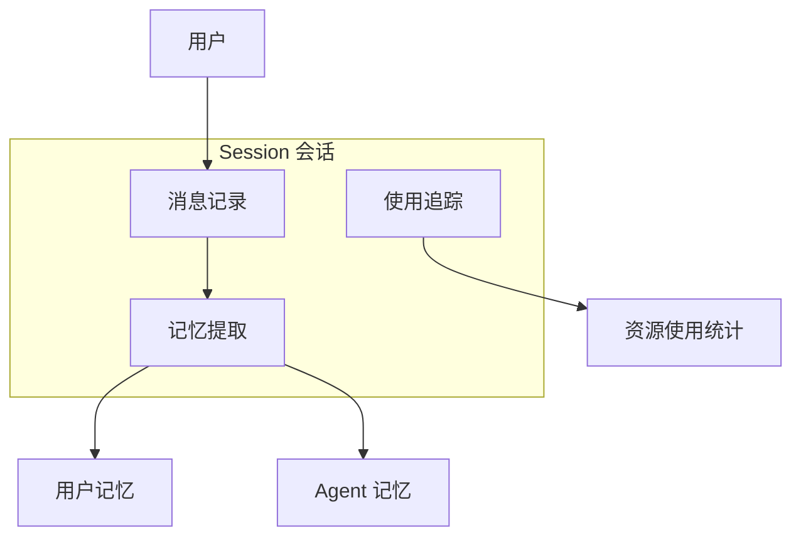
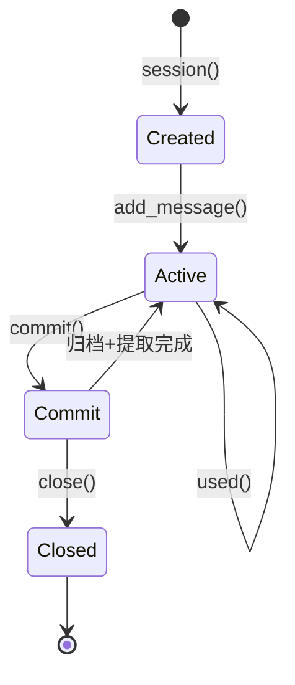
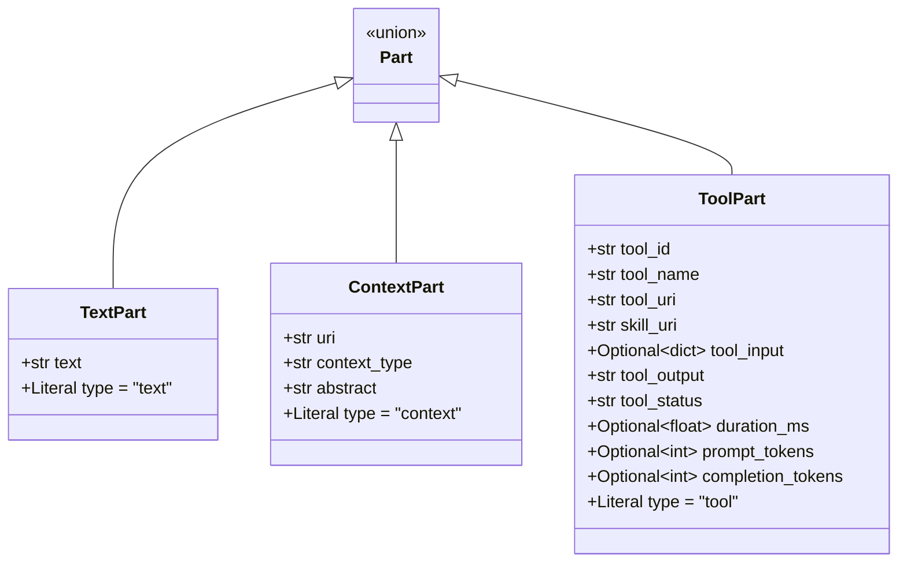
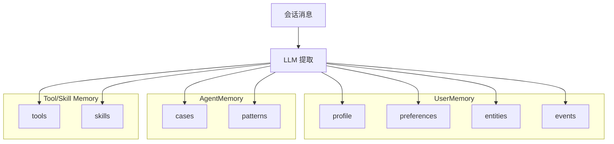
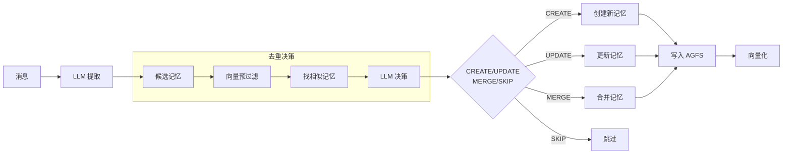
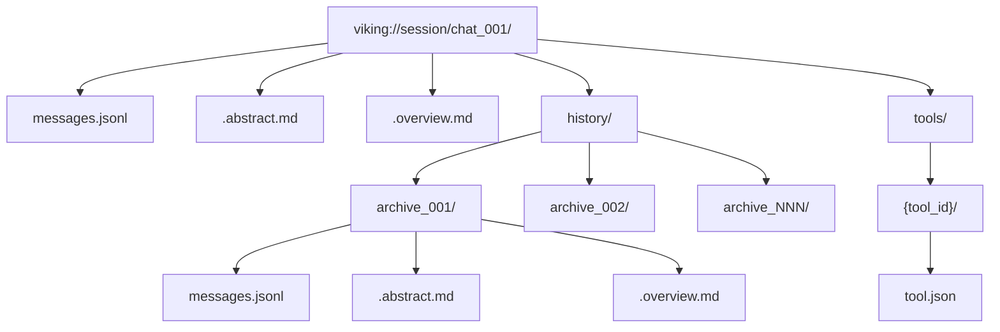
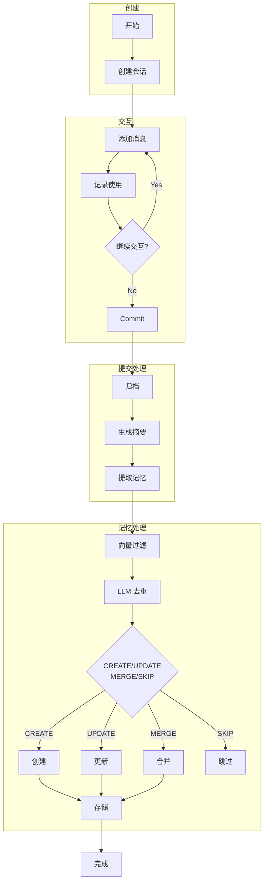
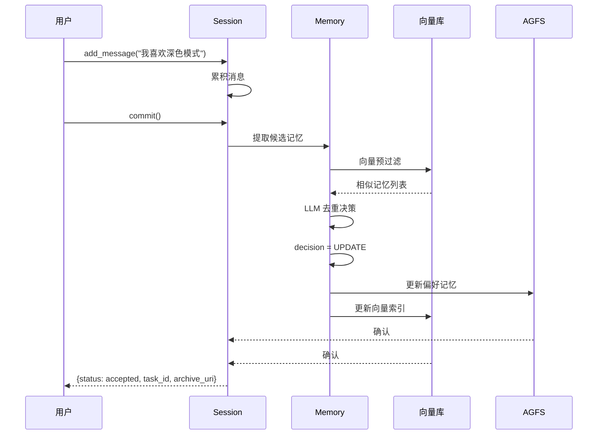

# OpenViking 会话管理详解

> 管理对话消息、记录上下文使用、提取长期记忆

## 目录

1. [会话概述](#1-会话概述)
2. [会话生命周期](#2-会话生命周期)
3. [消息结构](#3-消息结构)
4. [压缩策略](#4-压缩策略)
5. [记忆提取](#5-记忆提取)
6. [存储结构](#6-存储结构)
7. [流程图](#7-流程图)

---

## 1. 会话概述

### 1.1 会话的作用

Session 负责管理：
- **对话消息** - 记录用户和助手的交互
- **上下文使用** - 追踪 Agent 引用的资源
- **长期记忆** - 从交互中提取学习内容



### 1.2 核心 API

| 方法 | 说明 |
|------|------|
| `add_message(role, parts)` | 添加消息 |
| `used(contexts, skill)` | 记录使用的上下文/技能 |
| `commit()` | 提交：归档 + 记忆提取 |

---

## 2. 会话生命周期

### 2.1 状态转换



### 2.2 基本使用

```python
from openviking.message import TextPart, ContextPart

session = client.session(session_id="chat_001")

session.add_message(
    "user",
    [TextPart(text="如何配置 embedding?")],
)

session.add_message(
    "assistant",
    [
        TextPart(text="配置方法如下..."),
        ContextPart(
            uri="viking://resources/config.md",
            context_type="resource",
            abstract="OpenViking 配置指南",
        ),
    ],
)

session.used(contexts=["viking://user/memories/profile.md"])
session.used(skill={
    "uri": "viking://agent/skills/code-search",
    "input": "search config",
    "output": "found 3 files",
    "success": True,
})

result = session.commit()  # 同步：归档；异步：后台提取记忆
print(result["task_id"], result["archive_uri"])
```

> 注意：
> - **`Part` 类不在顶层包**，必须 `from openviking.message import TextPart, ContextPart, ToolPart`。
> - `Session.add_message(role, parts, role_id=None, created_at=None)`，注意 parts 是位置参数；`role_id` 用于在多用户/多 Agent 对话中区分实际发起者。

---

## 3. 消息结构

### 3.1 Message

```python
@dataclass
class Message:
    id: str                # "msg_{uuid4().hex}"
    role: str              # "user" | "assistant"
    parts: List[Part]
    role_id: Optional[str] # 实际发起者标识（多用户/多 agent）
    created_at: str        # ISO 时间戳
```

### 3.2 Part 类型

来自 `openviking/message/part.py`，所有 Part 都是 `dataclass` 且包含 `type` 字面量字段：

| 类型 | 关键字段 | 说明 |
|------|--------|------|
| `TextPart` | `text: str`, `type="text"` | 纯文本 |
| `ContextPart` | `uri: str`, `context_type: "memory"\|"resource"\|"skill"`, `abstract: str`, `type="context"` | 引用上下文（L0 摘要 + URI） |
| `ToolPart` | `tool_id`, `tool_name`, `tool_uri`, `skill_uri`, `tool_input: dict`, `tool_output: str`, `tool_status: "pending"\|"running"\|"completed"\|"error"`, `duration_ms`, `prompt_tokens`, `completion_tokens`, `type="tool"` | 工具调用 |



### 3.3 消息示例

```python
from openviking.message import TextPart, ContextPart, ToolPart

session.add_message("user", [
    TextPart(text="我想了解 OpenViking 的存储架构"),
])

session.add_message("assistant", [
    TextPart(text="OpenViking 采用双层存储架构："),
    ContextPart(
        uri="viking://resources/docs/storage.md",
        context_type="resource",
        abstract="AGFS/RAGFS + 向量库",
    ),
])

# 工具调用：注意字段名是 tool_name / tool_input / tool_output / tool_status
session.add_message("assistant", [
    TextPart(text="让我搜索一下相关文档"),
    ToolPart(
        tool_id="t_001",
        tool_name="search",
        tool_input={"query": "存储"},
        tool_output='{"results": [...]}',
        tool_status="completed",
    ),
])
```

> ⚠️ 旧版示例里的 `ToolPart(name=..., input=..., output=..., success=...)` 是错误的 —— 实际字段名带 `tool_` 前缀，且没有 `success` 字段，状态由 `tool_status` 字符串表达。

---

## 4. 压缩策略

### 4.1 归档流程

```mermaid
flowchart TB
    Commit[commit()] --> Step1[递增 compression_index]
    Step1 --> Step2[复制当前消息到归档目录]
    Step2 --> Step3[生成结构化摘要 LLM]
    Step3 --> Step4[清空当前消息列表]
    Step4 --> Complete[完成]
```

### 4.2 摘要格式

```markdown
# 会话摘要

**一句话概述**: [主题]: [意图] | [结果] | [状态]

## Analysis
关键步骤列表

## Primary Request and Intent
用户的核心目标

## Key Concepts
关键技术概念

## Pending Tasks
未完成的任务
```

### 4.3 压缩触发条件

- 会话消息超过阈值
- 手动调用 `commit()`
- 会话结束

---

## 5. 记忆提取

### 5.1 记忆分类

源码 `openviking/session/memory_extractor.py::MemoryCategory` 共 **8 类**：

| 分类 | 归属 | 说明 | 可合并 |
|------|------|------|--------|
| **profile**     | user  | 用户身份/属性（**单文件 profile.md**） | ✅ 追加合并 |
| **preferences** | user  | 用户偏好（按主题聚合） | ✅ |
| **entities**    | user  | 实体（人/项目/概念） | ✅ |
| **events**      | user  | 事件/决策/里程碑 | ❌ |
| **cases**       | agent | 问题 + 解决方案 | ❌ |
| **patterns**    | agent | 可复用流程/方法 | ❌ |
| **tools**       | agent | 工具调用统计与经验 | ✅ |
| **skills**      | agent | 技能执行流程与策略 | ✅ |



> ⚠️ 之前版本把 patterns 标为"可合并"是错误的——源码注释明确 patterns "each independent and not updated; create new pattern if modification needed"。

### 5.2 提取流程



### 5.3 去重决策

| 决策 | 说明 | 场景 |
|------|------|------|
| `CREATE` | 新记忆 | 没有相似记忆 |
| `UPDATE` | 更新现有 | 存在相似但需更新 |
| `MERGE` | 合并多条 | 多条相似记忆可合并 |
| `SKIP` | 完全重复 | 与现有完全相同 |

### 5.4 提取示例

```python
# 提交会话：Phase 1 同步归档，Phase 2 后台异步提取记忆
result = session.commit()
# 同步返回（来自 Session.commit_async 的真实字段）
# {
#   "session_id": "...",
#   "status": "accepted",        # 已接收，记忆提取在后台进行
#   "task_id": "...",            # 用 client.get_task(task_id) 查询
#   "archive_uri": "viking://session/.../history/archive_NNN/",
#   "archived": True,
#   "trace_id": "..."
# }

# 查询后台任务
task = client.get_task(result["task_id"])
print(task)  # {"status": "completed"|"running"|"failed", ...}
```

> 旧版示例里的 `{"memories_extracted": ..., "extracted_memories": [...]}` 字段名/结构与源码不一致——记忆提取是后台任务，不会同步返回到 commit 结果中。

---

## 6. 存储结构

### 6.1 会话目录

```
viking://session/{session_id}/
├── messages.jsonl            # 当前消息
├── .abstract.md               # 当前摘要
├── .overview.md              # 当前概览
├── history/
│   ├── archive_001/
│   │   ├── messages.jsonl
│   │   ├── .abstract.md
│   │   └── .overview.md
│   ├── archive_002/
│   └── archive_NNN/
└── tools/
    └── {tool_id}/
        └── tool.json
```



### 6.2 用户记忆目录

```
viking://user/memories/
├── profile.md                 # ⚠️ 单文件，追加合并
├── preferences/
│   ├── ui/
│   ├── coding/
│   └── writing/
├── entities/
│   ├── person_001/
│   └── project_001/
└── events/
    ├── decision_001/
    └── milestone_001/
```

### 6.3 Agent 记忆目录

```
viking://agent/memories/
├── cases/
│   ├── case_001/             # 每条独立，不更新
│   └── case_002/
├── patterns/
│   ├── workflow_001/         # 每条独立，不更新
│   └── technique_001/
├── tools/                    # 工具调用统计/经验
│   └── {tool_name}/
└── skills/                   # 技能执行流程/策略
    └── {skill_name}/
```

---

## 7. 流程图

### 7.1 完整会话流程



### 7.2 记忆更新流程



---

## 相关文档

- [架构概述](./01-项目概览与架构.md)
- [上下文类型](./05-上下文类型详解.md)
- [检索机制](./04-检索机制详解.md)
- [最佳实践](./08-最佳实践.md)
