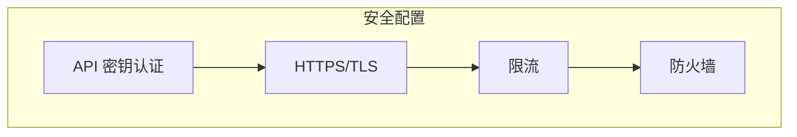

# OpenViking 部署指南

> 嵌入式模式 vs HTTP 服务模式

## 目录

1. [部署模式概述](#1-部署模式概述)
2. [嵌入式模式](#2-嵌入式模式)
3. [HTTP 服务模式](#3-http-服务模式)
4. [配置详解](#4-配置详解)
5. [Docker 部署](#5-docker-部署)
6. [安全配置](#6-安全配置)
7. [监控与运维](#7-监控与运维)

---

## 1. 部署模式概述

### 1.1 两种模式对比

| 特性 | 嵌入式模式 | HTTP 服务模式 |
|------|------------|---------------|
| **部署复杂度** | 低 | 中 |
| **多客户端共享** | ❌ | ✅ |
| **跨语言支持** | ❌ | ✅ |
| **资源占用** | 单进程 | 独立进程 |
| **适用场景** | 本地开发 | 生产环境 |

```mermaid
flowchart LR
    subgraph Embedded["嵌入式模式"]
        App1[App 1] --> OV1[OpenViking]
        App2[App 2] --> OV2[OpenViking]
    end
    
    subgraph Server["HTTP 服务模式"]
        App3[App 1] --> HTTP[HTTP API]
        App4[App 2] --> HTTP
        App5[App 3] --> HTTP
        HTTP --> Server[OpenViking Server]
    end
    
    style Embedded fill:#e1f5fe
    style Server fill:#fff3e0
```

---

## 2. 嵌入式模式

### 2.1 适用场景

- 本地开发调试
- 单进程应用
- 轻量级使用

### 2.2 使用方式

```python
import openviking as ov

# OpenViking == SyncOpenViking（同步客户端）
client = ov.OpenViking(path="./data")
client.initialize()

# 使用 ...

client.close()
```

### 2.3 数据目录结构

`storage.workspace`（默认 `~/.openviking/data`）下大致结构如下：

```
{workspace}/
├── agfs/              # RAGFS/AGFS 内容存储（L0/L1/L2 实际文件）
├── vector/            # 向量索引（向量库为 local 后端时）
└── ...                # 任务、缓存等
```

> 配置：`~/.openviking/ov.conf` —— 由 `openviking-server init` 生成或手动编辑。

---

## 3. HTTP 服务模式

### 3.1 服务端部署

#### 3.1.1 安装依赖

```bash
pip install openviking
```

#### 3.1.2 创建配置

推荐使用交互式向导：

```bash
openviking-server init     # 选择 provider、登录 OAuth、生成 ov.conf
openviking-server doctor   # 校验本地依赖与连通性
```

也可手动写入 `~/.openviking/ov.conf`：

```bash
mkdir -p ~/.openviking
cat > ~/.openviking/ov.conf << 'EOF'
{
  "storage": {
    "workspace": "/home/your-name/openviking_workspace"
  },
  "embedding": {
    "dense": {
      "api_base": "https://ark.cn-beijing.volces.com/api/v3",
      "api_key": "YOUR_API_KEY",
      "provider": "volcengine",
      "dimension": 1024,
      "model": "doubao-embedding-vision-251215"
    }
  },
  "vlm": {
    "api_base": "https://ark.cn-beijing.volces.com/api/v3",
    "api_key": "YOUR_API_KEY",
    "provider": "volcengine",
    "model": "doubao-seed-2-0-pro-260215"
  }
}
EOF
```

#### 3.1.3 启动服务

⚠️ 服务入口是 `openviking-server`（pyproject `[project.scripts]` 注册），**不存在 `python -m openviking serve` 这种用法**——`openviking/` 包内没有 `__main__.py`。

```bash
# 默认 host=127.0.0.1, port=1933
openviking-server

# 指定 host/port/config
openviking-server --host 0.0.0.0 --port 8080 --config ~/.openviking/ov.conf

# 多 worker（factory 模式启动）
openviking-server --workers 4

# 启动同时拉起 vikingbot 网关
openviking-server --with-bot

# 后台运行
nohup openviking-server > server.log 2>&1 &
```

#### 3.1.4 完整 CLI 参数

```bash
openviking-server --help

# 主要参数（来自 openviking/server/bootstrap.py）：
# --host HOST          绑定地址（默认 127.0.0.1，传入 "all" 表示绑定全部）
# --port PORT          端口号（默认 1933）
# --config PATH        ov.conf 路径
# --workers N          uvicorn worker 进程数（默认 1）
# --with-bot           启用 Bot API 代理到 vikingbot
# --bot-port PORT      vikingbot 网关端口（默认 18790）
# --enable-bot-logging / --disable-bot-logging
# --bot-log-dir PATH
# --version
```

> API Key 是写在 `ov.conf` 的 `server.root_api_key`，**不是命令行参数**；详见下文 [4.1 完整配置项](#41-完整配置项) 与 [6. 安全配置](#6-安全配置)。

### 3.2 客户端连接

#### 3.2.1 Python SDK

```python
import openviking as ov

# 连接远程服务
client = ov.SyncHTTPClient(
    url="http://localhost:1933",
    api_key="your-api-key"  # 如果服务端配置了
)

# 使用方式与嵌入式相同
result = client.find("query", target_uri="viking://resources/")
```

#### 3.2.2 cURL

参考实际路由（`openviking/server/routers/`）：

```bash
# 搜索 - find
curl -X POST http://localhost:1933/api/v1/search/find \
  -H "Content-Type: application/json" \
  -H "X-API-Key: your-api-key" \
  -d '{
    "query": "OAuth 认证",
    "target_uri": "viking://resources/",
    "limit": 10
  }'

# 搜索 - search（带会话）
curl -X POST http://localhost:1933/api/v1/search/search \
  -H "Content-Type: application/json" \
  -H "X-API-Key: your-api-key" \
  -d '{
    "query": "帮我创建用户认证模块",
    "session_id": "chat_001"
  }'

# 列出目录
curl http://localhost:1933/api/v1/fs/ls \
  -H "X-API-Key: your-api-key" \
  -G --data-urlencode "uri=viking://resources/"

# 健康检查
curl http://localhost:1933/health
curl http://localhost:1933/ready
curl http://localhost:1933/api/v1/system/status
```

> 路由前缀汇总（来自 `openviking/server/routers/`）：
> `/api/v1/search`、`/api/v1/sessions`、`/api/v1/fs`、`/api/v1/relations`、`/api/v1/pack`、`/api/v1/observer`、`/api/v1/maintenance`、`/api/v1/admin`、`/api/v1/debug`、`/api/v1/system`、`/api/v1/stats`、`/api/v1/content`、`/api/v1/tasks`、`/webdav/resources`（WebDAV）。

#### 3.2.3 其他语言

```javascript
// JavaScript/Node.js
const response = await fetch('http://localhost:1933/api/v1/search/find', {
  method: 'POST',
  headers: {
    'Content-Type': 'application/json',
    'X-API-Key': 'your-api-key'
  },
  body: JSON.stringify({
    query: 'OAuth 认证',
    target_uri: 'viking://resources/'
  })
});
```

---

## 4. 配置详解

### 4.1 完整配置项

```json
{
  "server": {
    "host": "127.0.0.1",
    "port": 1933,
    "workers": 1,
    "auth_mode": null,
    "root_api_key": "your-secret-key",
    "cors_origins": ["*"],
    "with_bot": false,
    "bot_api_url": "http://localhost:18790",
    "encryption_enabled": false,
    "api_key_hashing_enabled": false
  },
  "storage": {
    "workspace": "/data/openviking",
    "vectordb": {
      "backend": "local",
      "path": "/data/openviking/vector"
    }
  },
  "embedding": {
    "dense": {
      "api_base": "https://ark.cn-beijing.volces.com/api/v3",
      "api_key": "your-api-key",
      "provider": "volcengine",
      "dimension": 1024,
      "model": "doubao-embedding-vision-251215"
    },
    "max_concurrent": 10
  },
  "vlm": {
    "api_base": "https://ark.cn-beijing.volces.com/api/v3",
    "api_key": "your-api-key",
    "provider": "volcengine",
    "model": "doubao-seed-2-0-pro-260215",
    "max_concurrent": 100
  },
  "rerank": {
    "api_base": "https://ark.cn-beijing.volces.com/api/v3",
    "api_key": "your-api-key",
    "provider": "volcengine",
    "model": "doubao-seed-rerank"
  }
}
```

> **重点字段**（来自 `openviking/server/config.py::ServerConfig`）：
> - **默认 `host = 127.0.0.1`**，不是 `0.0.0.0`；要对外服务请显式 `--host 0.0.0.0`。
> - **API Key 字段名是 `root_api_key`**（不是 `api_key`）；当 `auth_mode=null` 时，根据 `root_api_key` 自动选择 `API_KEY` 或 `DEV` 模式。
> - `workers` 默认 1；多 worker 模式由 `--workers N` 或配置触发。

### 4.2 环境变量

| 变量 | 说明 | 默认值 |
|------|------|---------|
| `OPENVIKING_CONFIG_FILE` | 配置文件路径 | `~/.openviking/ov.conf` |
| `RAGFS_IMPL` | RAGFS 实现（`auto`/`rust`/`go`） | `auto` |

> 数据目录由配置文件中的 `storage.workspace` 控制，不要使用未实际定义的 `OPENVIKING_DATA_DIR`。

---

## 5. Docker 部署

### 5.1 Dockerfile

> 项目根目录下已经有官方 `Dockerfile`，建议优先使用；下面是简化示例：

```dockerfile
FROM python:3.10-slim

WORKDIR /app

RUN pip install --no-cache-dir openviking

COPY ov.conf /root/.openviking/ov.conf

EXPOSE 1933

# 使用 pyproject 注册的入口脚本
CMD ["openviking-server", "--host", "0.0.0.0", "--port", "1933"]
```

### 5.2 docker-compose.yaml

```yaml
services:
  openviking:
    image: openviking:latest
    ports:
      - "1933:1933"
    volumes:
      - ./data:/data
      - ./ov.conf:/root/.openviking/ov.conf
    restart: unless-stopped
```

### 5.3 启动

```bash
docker compose up -d
```

---

## 6. 安全配置

### 6.1 API 密钥

```json
{
  "server": {
    "root_api_key": "your-secure-random-key",
    "auth_mode": "API_KEY",
    "api_key_hashing_enabled": true
  }
}
```

> `auth_mode` 留空时会根据 `root_api_key` 是否非空自动判定（`API_KEY` 或 `DEV`）。

### 6.2 使用密钥

```python
import openviking as ov

client = ov.SyncHTTPClient(
    url="http://localhost:1933",
    api_key="your-secure-random-key",
)
client.initialize()
```

调用 HTTP API 时通过 `X-API-Key` 头传递。

### 6.3 生产环境建议



1. **使用 HTTPS** - 配置 SSL 证书
2. **API 密钥** - 设置强密钥
3. **限流** - 防止滥用
4. **防火墙** - 限制访问 IP

---

## 7. 监控与运维

### 7.1 健康检查

```bash
curl http://localhost:1933/health         # 基础健康
curl http://localhost:1933/ready          # 就绪检查
curl http://localhost:1933/api/v1/system/status   # 详细组件状态
```

也可在嵌入式模式下直接调用：

```python
client.is_healthy()
status = client.get_status()
```

### 7.2 日志

日志由配置文件中的 `log` 段控制（参考 README 示例）：

```json
{
  "log": {
    "level": "INFO",
    "output": "stdout"
  }
}
```

### 7.3 性能调优

| 参数 | 配置位置 | 说明 |
|------|----------|------|
| `server.workers` | `ov.conf` 或 `--workers` | uvicorn worker 数 |
| `embedding.max_concurrent` | `ov.conf` | 嵌入并发请求数（默认 10） |
| `vlm.max_concurrent` | `ov.conf` | LLM 并发调用数（默认 100） |
| `storage.vectordb.backend` | `ov.conf` | `local` / `http` / `volcengine` |
| `RAGFS_IMPL` | env | `auto` / `rust` / `go` |

---

## 相关文档

- [快速开始](./02-快速开始指南.md)
- [配置指南](./configuration.md)
- [API 参考](./06-API参考.md)
