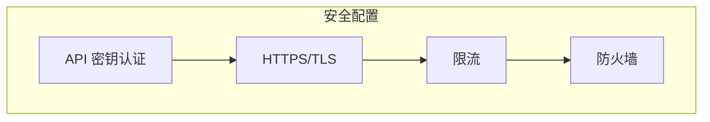

# OpenViking 部署指南

> 嵌入式模式 vs HTTP 服务模式

## 目录

1. [部署模式概述](#1-部署模式概述)
2. [嵌入式模式](#2-嵌入式模式)
3. [HTTP 服务模式](#3-http-服务模式)
4. [配置详解](#4-配置详解)
5. [Docker 部署](#5-docker-部署)
6. [安全配置](#6-安全配置)
7. [监控与运维](#7-监控与运维)

---

## 1. 部署模式概述

### 1.1 两种模式对比

| 特性 | 嵌入式模式 | HTTP 服务模式 |
|------|------------|---------------|
| **部署复杂度** | 低 | 中 |
| **多客户端共享** | ❌ | ✅ |
| **跨语言支持** | ❌ | ✅ |
| **资源占用** | 单进程 | 独立进程 |
| **适用场景** | 本地开发 | 生产环境 |

```mermaid
flowchart LR
    subgraph Embedded["嵌入式模式"]
        App1[App 1] --> OV1[OpenViking]
        App2[App 2] --> OV2[OpenViking]
    end
    
    subgraph Server["HTTP 服务模式"]
        App3[App 1] --> HTTP[HTTP API]
        App4[App 2] --> HTTP
        App5[App 3] --> HTTP
        HTTP --> Server[OpenViking Server]
    end
    
    style Embedded fill:#e1f5fe
    style Server fill:#fff3e0
```

---

## 2. 嵌入式模式

### 2.1 适用场景

- 本地开发调试
- 单进程应用
- 轻量级使用

### 2.2 使用方式

```python
import openviking as ov

# 初始化嵌入式客户端
client = ov.SyncOpenViking(path="./data")
client.initialize()

# 使用...

client.close()
```

### 2.3 数据目录结构

```
./data/
├── agfs/              # AGFS 内容存储
│   ├── resources/
│   ├── user/
│   └── agent/
├── vector/            # 向量索引
│   └── index/
└── config.json        # 本地配置
```

---

## 3. HTTP 服务模式

### 3.1 服务端部署

#### 3.1.1 安装依赖

```bash
pip install openviking
```

#### 3.1.2 创建配置

```bash
mkdir -p ~/.openviking
cat > ~/.openviking/ov.conf << 'EOF'
{
  "embedding": {
    "dense": {
      "api_base": "https://ark.cn-beijing.volces.com/api/v3",
      "api_key": "YOUR_API_KEY",
      "provider": "volcengine",
      "dimension": 1024,
      "model": "doubao-embedding-vision-250615"
    }
  },
  "vlm": {
    "api_base": "https://ark.cn-beijing.volces.com/api/v3",
    "api_key": "YOUR_API_KEY",
    "provider": "volcengine",
    "model": "doubao-seed-1-8-251228"
  }
}
EOF
```

#### 3.1.3 启动服务

```bash
# 默认端口 1933
python -m openviking serve

# 指定端口
python -m openviking serve --port 8080

# 后台运行
nohup python -m openviking serve > server.log 2>&1 &
```

#### 3.1.4 服务配置

```bash
# 查看帮助
python -m openviking serve --help

# 输出:
# --port PORT         服务端口 (默认: 1933)
# --host HOST         监听地址 (默认: 0.0.0.0)
# --workers WORKERS   工作进程数
# --api-key API_KEY   API 密钥
```

### 3.2 客户端连接

#### 3.2.1 Python SDK

```python
import openviking as ov

# 连接远程服务
client = ov.SyncHTTPClient(
    url="http://localhost:1933",
    api_key="your-api-key"  # 如果服务端配置了
)

# 使用方式与嵌入式相同
result = client.find("query", target_uri="viking://resources/")
```

#### 3.2.2 cURL

```bash
# 搜索 API
curl -X POST http://localhost:1933/api/v1/search/find \
  -H "Content-Type: application/json" \
  -H "X-API-Key: your-api-key" \
  -d '{
    "query": "OAuth 认证",
    "target_uri": "viking://resources/"
  }'

# 列出目录
curl http://localhost:1933/api/v1/fs/ls \
  -H "X-API-Key: your-api-key" \
  -G --data-urlencode "uri=viking://resources/"
```

#### 3.2.3 其他语言

```javascript
// JavaScript/Node.js
const response = await fetch('http://localhost:1933/api/v1/search/find', {
  method: 'POST',
  headers: {
    'Content-Type': 'application/json',
    'X-API-Key': 'your-api-key'
  },
  body: JSON.stringify({
    query: 'OAuth 认证',
    target_uri: 'viking://resources/'
  })
});
```

---

## 4. 配置详解

### 4.1 完整配置项

```json
{
  "server": {
    "host": "0.0.0.0",
    "port": 1933,
    "workers": 4,
    "api_key": "your-secret-key"
  },
  "embedding": {
    "dense": {
      "api_base": "https://ark.cn-beijing.volces.com/api/v3",
      "api_key": "your-api-key",
      "provider": "volcengine",
      "dimension": 1024,
      "model": "doubao-embedding-vision-250615"
    }
  },
  "vlm": {
    "api_base": "https://ark.cn-beijing.volces.com/api/v3",
    "api_key": "your-api-key",
    "provider": "volcengine",
    "model": "doubao-seed-1-8-251228"
  },
  "rerank": {
    "api_base": "https://ark.cn-beijing.volces.com/api/v3",
    "api_key": "your-api-key",
    "provider": "volcengine",
    "model": "doubao-seed-rerank"
  },
  "storage": {
    "agfs": {
      "backend": "localfs",
      "path": "/data/openviking"
    },
    "vectordb": {
      "backend": "local",
      "path": "/data/openviking/vector"
    }
  }
}
```

### 4.2 环境变量

| 变量 | 说明 | 默认值 |
|------|------|---------|
| `OPENVIKING_CONFIG_FILE` | 配置文件路径 | `~/.openviking/ov.conf` |
| `OPENVIKING_DATA_DIR` | 数据目录 | `./data` |
| `OPENVIKING_LOG_LEVEL` | 日志级别 | `INFO` |

---

## 5. Docker 部署

### 5.1 Dockerfile

```dockerfile
FROM python:3.10-slim

WORKDIR /app

COPY pyproject.toml .
RUN pip install openviking

# 复制配置
COPY ov.conf /root/.openviking/ov.conf

# 暴露端口
EXPOSE 1933

CMD ["python", "-m", "openviking", "serve"]
```

### 5.2 docker-compose.yaml

```yaml
version: '3.8'

services:
  openviking:
    image: openviking:latest
    ports:
      - "1933:1933"
    volumes:
      - ./data:/data
      - ./ov.conf:/root/.openviking/ov.conf
    environment:
      - OPENVIKING_LOG_LEVEL=INFO
    restart: unless-stopped
```

### 5.3 启动

```bash
docker-compose up -d
```

---

## 6. 安全配置

### 6.1 API 密钥

```json
{
  "server": {
    "api_key": "your-secure-random-key"
  }
}
```

### 6.2 使用密钥

```python
client = ov.SyncHTTPClient(
    url="http://localhost:1933",
    api_key="your-secure-random-key"
)
```

### 6.3 生产环境建议



1. **使用 HTTPS** - 配置 SSL 证书
2. **API 密钥** - 设置强密钥
3. **限流** - 防止滥用
4. **防火墙** - 限制访问 IP

---

## 7. 监控与运维

### 7.1 健康检查

```bash
# 检查服务状态
curl http://localhost:1933/health
```

### 7.2 日志

```bash
# 查看日志
tail -f server.log

# 日志级别
export OPENVIKING_LOG_LEVEL=DEBUG
```

### 7.3 性能调优

| 参数 | 推荐值 | 说明 |
|------|--------|------|
| `workers` | CPU 核心数 | 工作进程数 |
| `batch_size` | 32-64 | 批处理大小 |
| `vector_cache` | 1GB+ | 向量缓存 |

---

## 相关文档

- [快速开始](./02-快速开始指南.md)
- [配置指南](./configuration.md)
- [API 参考](./06-API参考.md)
