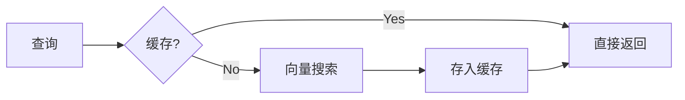
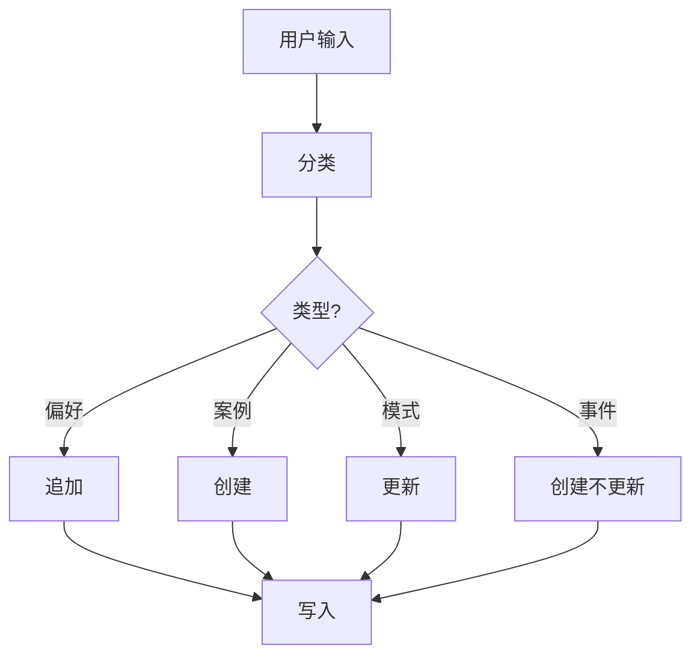

# OpenViking 最佳实践

> 最佳实践与性能优化指南

## 目录

1. [性能优化](#1-性能优化)
2. [记忆管理](#2-记忆管理)
3. [检索策略](#3-检索策略)
4. [成本控制](#4-成本控制)
5. [调试技巧](#5-调试技巧)
6. [常见模式](#6-常见模式)

---

## 1. 性能优化

### 1.1 异步处理

```python
import asyncio
import openviking as ov

async def main():
    client = ov.OpenViking(path="./data")
    await client.initialize()
    
    # 并发添加多个资源
    results = await asyncio.gather(
        client.add_resource(path="./docs1"),
        client.add_resource(path="./docs2"),
        client.add_resource(path="./docs3")
    )
    
    # 并发搜索
    results = await asyncio.gather(
        client.find("认证", target_uri="viking://resources/auth"),
        client.find("API", target_uri="viking://resources/api"),
        client.find("配置", target_uri="viking://resources/config")
    )
    
    await client.close()

asyncio.run(main())
```

### 1.2 批量处理

```python
# 批量添加资源
uris = [
    "./docs/api/",
    "./docs/guide/",
    "./docs/faq/"
]

for uri in uris:
    client.add_resource(path=uri)

# 等待统一处理完成
client.wait_processed()
```

### 1.3 缓存策略



```python
# 使用 L0 缓存减少 LLM 调用
def get_content(uri, use_cache=True):
    # 先尝试 L0
    abstract = client.abstract(uri)
    
    if needs_more(abstract):
        overview = client.overview(uri)
        if needs_more(overview):
            return client.read(uri)
        return overview
    return abstract
```

---

## 2. 记忆管理

### 2.1 记忆更新策略



### 2.2 手动记忆管理

```python
# 手动创建用户偏好
client.write(
    uri="viking://user/memories/preferences/ui.md",
    content="# UI 偏好\n\n- 主题: 深色模式\n- 字体: 14px\n"
)

# 手动创建 Agent 技能
client.add_skill({
    "name": "code-review",
    "description": "代码审查技能",
    "content": "# code-review\n\n## 规则\n..."
})
```

### 2.3 记忆清理

```python
# 删除特定记忆
client.rm("viking://user/memories/events/old_event")

# 清理历史会话
client.rm("viking://session/old_session", recursive=True)
```

---

## 3. 检索策略

### 3.1 渐进式加载

```python
def smart_retrieve(query, target_uri):
    # 1. L0 快速筛选
    results = client.find(query, target_uri=target_uri, limit=20)
    
    # 2. L1 精筛
    candidates = []
    for r in results.resources:
        overview = client.overview(r.uri)
        if relevant(overview, query):
            candidates.append(r)
    
    # 3. 按需加载 L2
    final = []
    for c in candidates[:5]:
        if needs_detail(c):
            content = client.read(c.uri)
            final.append({"uri": c.uri, "content": content, "score": c.score})
        else:
            final.append({"uri": c.uri, "overview": client.overview(c.uri), "score": c.score})
    
    return final
```

### 3.2 意图预判

```python
# 根据查询类型选择检索策略
def select_strategy(query):
    if query.startswith("如何") or query.startswith("怎么"):
        return "howto"  # 需要详细步骤
    elif query.startswith("什么是"):
        return "definition"  # 需要定义解释
    elif any(kw in query for kw in ["配置", "设置", "安装"]):
        return "guide"  # 需要指南
    else:
        return "general"
```

### 3.3 多路召回

```python
def multi_retrieve(query, target_uri):
    # 1. 语义搜索
    semantic_results = client.find(query, target_uri=target_uri)
    
    # 2. 关键词搜索
    keyword_results = client.grep(keyword, uri=target_uri)
    
    # 3. 关联搜索
    relations = client.relations(target_uri)
    
    # 4. 合并去重
    merged = merge_results(
        semantic_results,
        keyword_results,
        relations
    )
    
    return merged
```

---

## 4. 成本控制

### 4.1 Token 优化

| 策略 | 节省比例 | 适用场景 |
|------|----------|----------|
| L0 预筛选 | 60-80% | 大规模检索 |
| L1 导航 | 40-60% | 需要概览 |
| 按需 L2 | 30-50% | 详细阅读 |

```python
# 预算感知的检索
def budget_retrieve(query, target_uri, token_budget=2000):
    # 估算 token 使用
    results = client.find(query, target_uri=target_uri)
    
    total_tokens = 0
    selected = []
    
    for r in results.resources:
        # 加载 L1
        overview = client.overview(r.uri)
        tokens = estimate_tokens(overview)
        
        if total_tokens + tokens <= token_budget:
            selected.append({"uri": r.uri, "content": overview})
            total_tokens += tokens
        else:
            # 不足时用 L0
            selected.append({"uri": r.uri, "content": r.abstract})
            total_tokens += 100
    
    return selected
```

### 4.2 模型选择

```python
# 生产环境推荐配置
config = {
    "embedding": {
        "model": "doubao-embedding-vision-250615",  # 性价比高
        "dimension": 1024
    },
    "vlm": {
        "model": "doubao-seed-1-8-251228"  # 成本优化
    }
}
```

---

## 5. 调试技巧

### 5.1 查看检索轨迹

```python
# 启用调试模式
client = ov.OpenViking(
    path="./data",
    debug=True
)

# 执行搜索
results = client.find("query", target_uri="viking://resources/")

# 查看检索轨迹
if results.query_plan:
    print("意图分析:", results.query_plan.intent)
    print("检索路径:", results.query_plan.path)
```

### 5.2 查看向量索引

```python
# 查看特定 URI 的向量信息
info = client.debug_vector("viking://resources/docs/auth.md")
print(info)
# {
#   "uri": "...",
#   "vector_exists": True,
#   "dimension": 1024,
#   "created_at": "...",
#   "active_count": 5
# }
```

### 5.3 检查会话状态

```python
# 查看会话详情
session = client.session(session_id="chat_001")
info = session.info()

print(f"消息数: {info['message_count']}")
print(f"压缩次数: {info['compression_count']}")
print(f"提取记忆: {info['extracted_memories']}")
```

---

## 6. 常见模式

### 6.1 Agent 上下文构建

```python
def build_agent_context(agent_id, task):
    # 1. 获取 Agent 技能
    skills = client.find(
        task,
        target_uri="viking://agent/skills/"
    )
    
    # 2. 获取相关记忆
    memory = client.find(
        task,
        target_uri="viking://agent/memories/"
    )
    
    # 3. 获取用户偏好
    prefs = client.find(
        "用户偏好",
        target_uri="viking://user/memories/preferences/"
    )
    
    # 4. 组合上下文
    context = {
        "skills": skills.skills,
        "memory": memory.memories,
        "preferences": prefs.memories
    }
    
    return context
```

### 6.2 RAG 管道

```python
def rag_pipeline(query, documents):
    # 1. 添加文档
    for doc in documents:
        result = client.add_resource(path=doc)
    
    client.wait_processed()
    
    # 2. 检索
    results = client.find(query, target_uri="viking://resources/")
    
    # 3. 构建 Prompt
    context = "\n\n".join([
        f"## {r.uri}\n{client.overview(r.uri)}"
        for r in results.resources[:3]
    ])
    
    prompt = f"""基于以下上下文回答问题:

{context}

问题: {query}

回答:"""
    
    return prompt
```

### 6.3 多租户隔离

```python
class TenantClient:
    def __init__(self, client, tenant_id):
        self.client = client
        self.tenant_id = tenant_id
    
    @property
    def base_uri(self):
        return f"viking://tenant_{self.tenant_id}/"
    
    def find(self, query, **kwargs):
        target = kwargs.get("target_uri", self.base_uri)
        return self.client.find(query, target_uri=target, **kwargs)
    
    def add_resource(self, path, **kwargs):
        return self.client.add_resource(path, reason=f"tenant:{self.tenant_id}")
```

---

## 相关文档

- [架构概述](./01-项目概览与架构.md)
- [API 参考](./06-API参考.md)
- [检索机制](./04-检索机制详解.md)
