# OpenViking 技术原理图解

> 完整的技术原理与架构图解

## 目录

1. [整体架构](#1-整体架构)
2. [核心流程](#2-核心流程)
3. [模块关系](#3-模块关系)
4. [数据流向](#4-数据流向)
5. [状态机](#5-状态机)

---

## 1. 整体架构

### 1.1 系统架构全景图

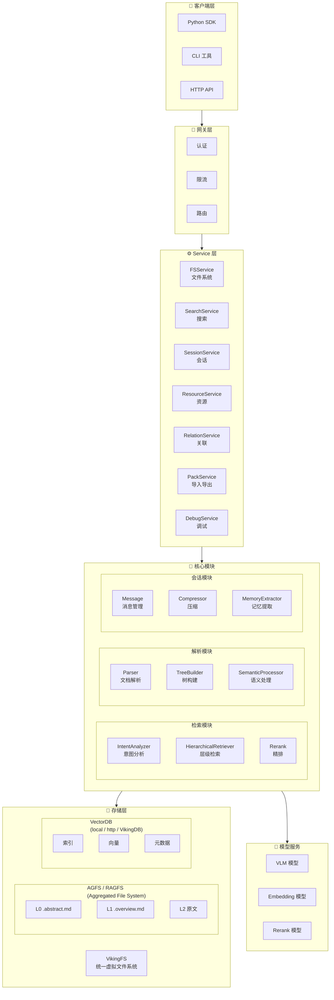

---

## 2. 核心流程

### 2.1 资源添加流程

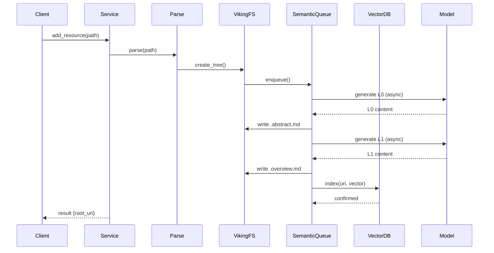

### 2.2 检索流程

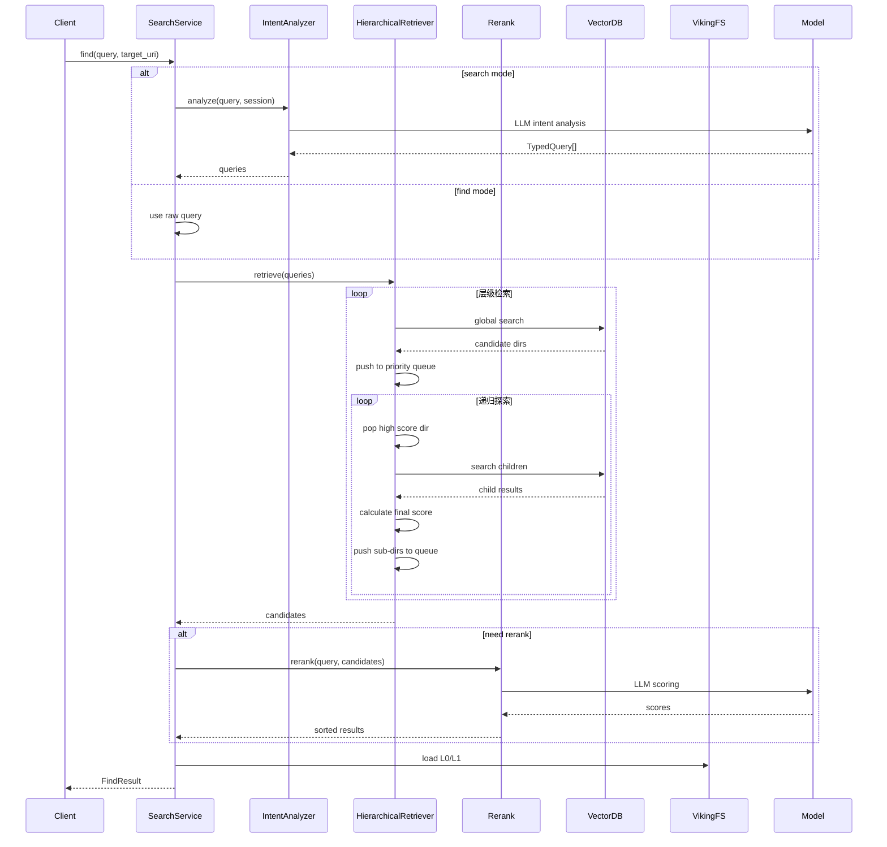

### 2.3 会话提交流程

OpenViking 的 `session.commit()` 分两阶段：**Phase 1 同步归档（PathLock 保护）**，**Phase 2 异步提取记忆**。

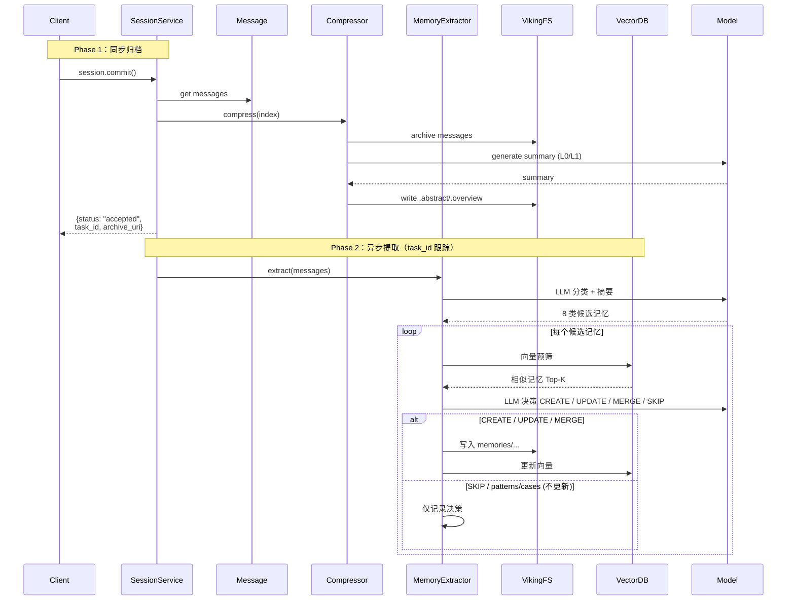

---

## 3. 模块关系

### 3.1 模块依赖图

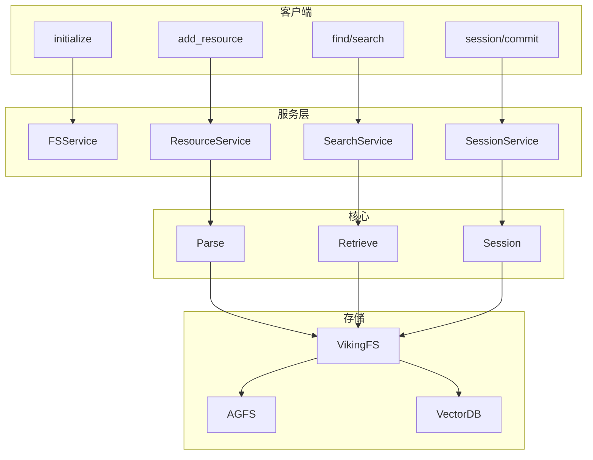

### 3.2 数据模型关系

OpenViking 共有 **3 种上下文类型 + 8 种记忆分类**，关系如下：

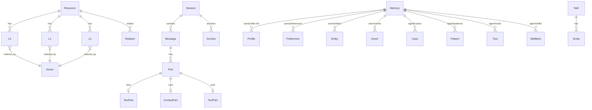

> 8 类记忆分别对应 `MemoryCategory` 中的 PROFILE、PREFERENCES、ENTITIES、EVENTS、CASES、PATTERNS、TOOLS、SKILLS（详见 `openviking/session/memory_extractor.py`）。其中 `profile` 是单文件，`patterns/cases/events` 不可更新。

---

## 4. 数据流向

### 4.1 写入数据流

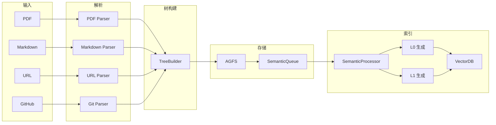

### 4.2 读取数据流

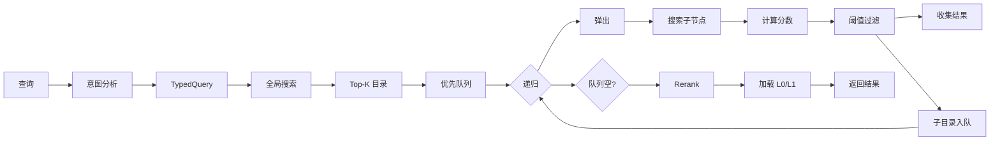

---

## 5. 状态机

### 5.1 资源处理状态

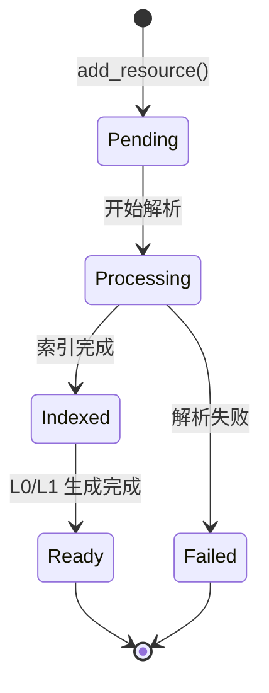

### 5.2 会话状态

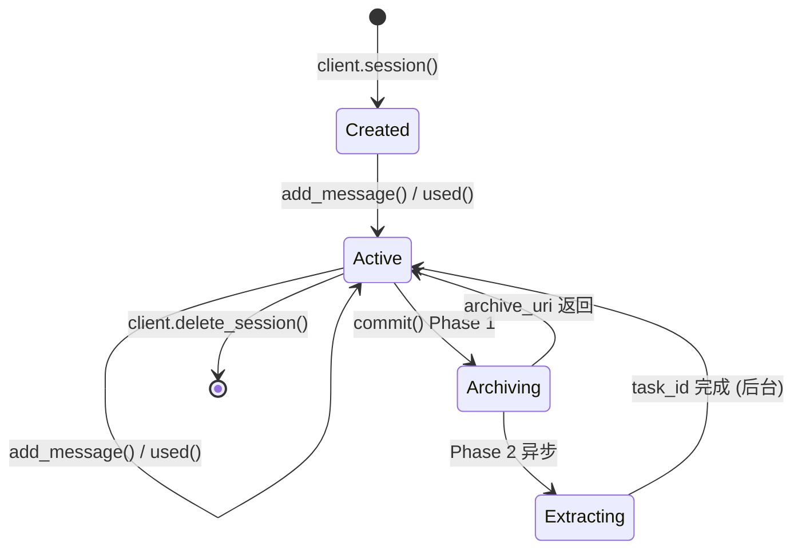

> Phase 2 通过 `client.get_task(task_id)` 跟踪状态。

### 5.3 记忆更新状态

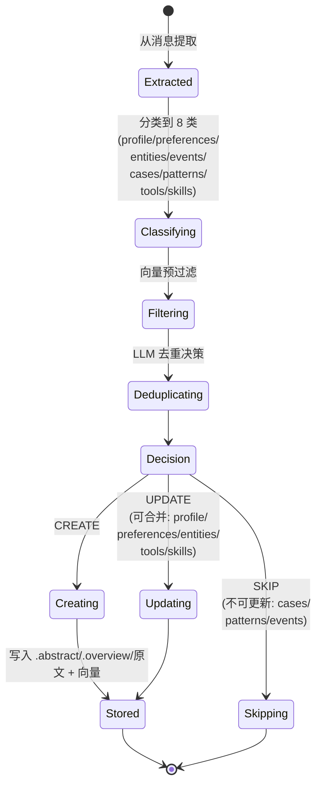

> 不可更新的 `cases / patterns / events` 在重复时不会覆盖，只会创建新记录或跳过。

---

## 相关文档

- [项目概览](./01-项目概览与架构.md)
- [快速开始](./02-快速开始指南.md)
- [存储架构](./03-存储架构详解.md)
- [检索机制](./04-检索机制详解.md)
- [会话管理](./05-会话管理详解.md)
- [API 参考](./06-API参考.md)
- [部署指南](./07-部署指南.md)
- [最佳实践](./08-最佳实践.md)
