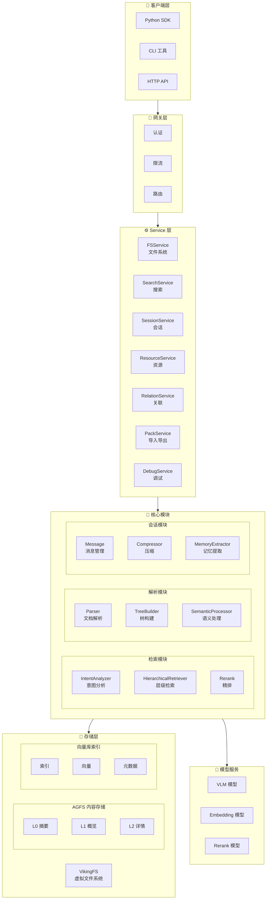
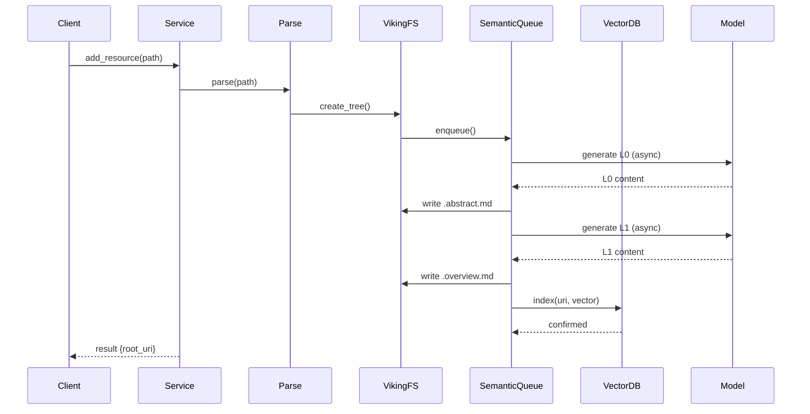
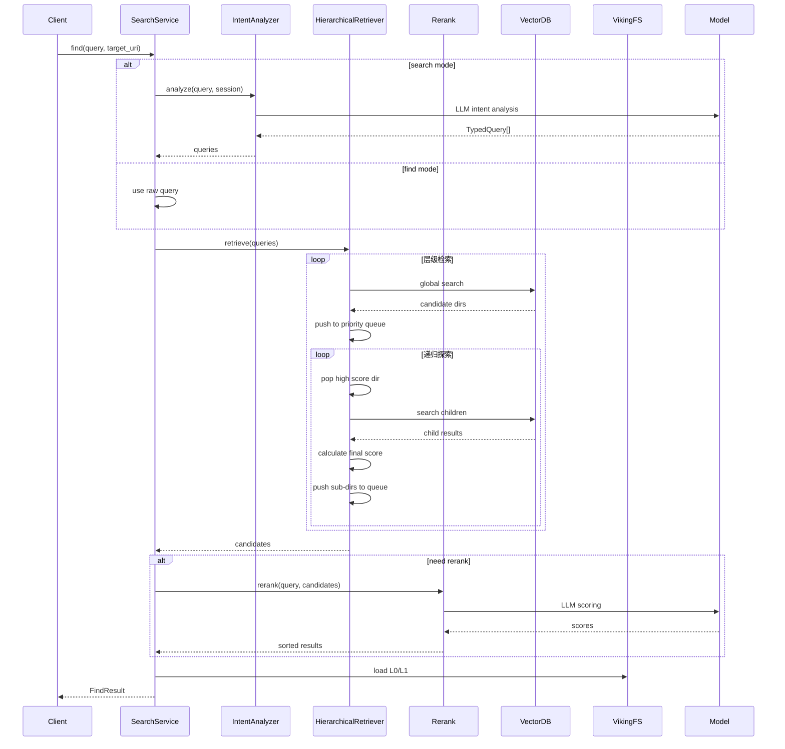
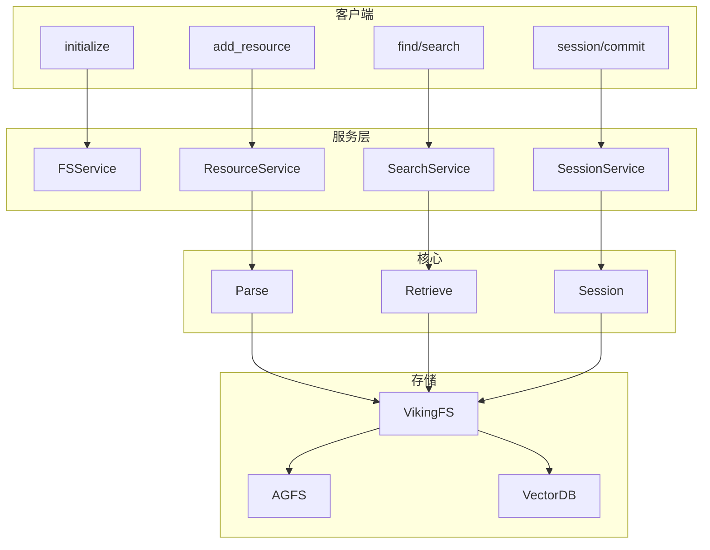
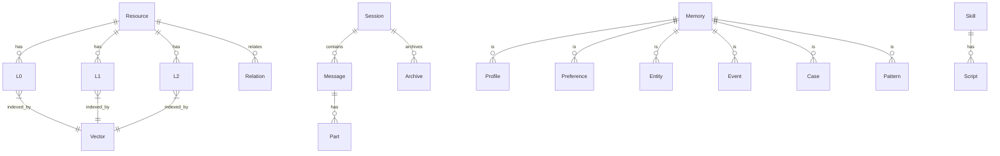
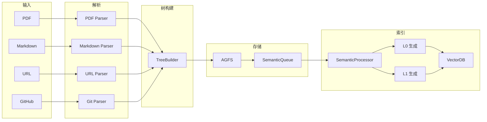
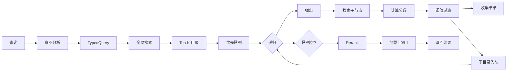
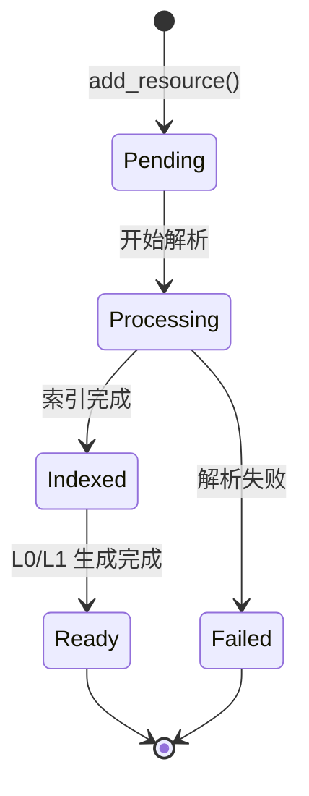
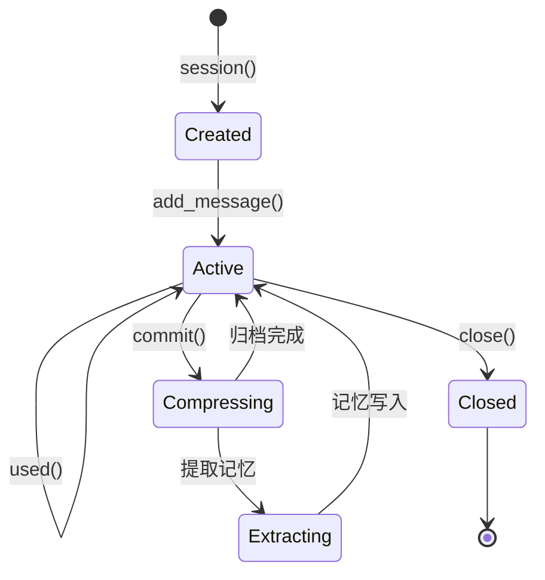
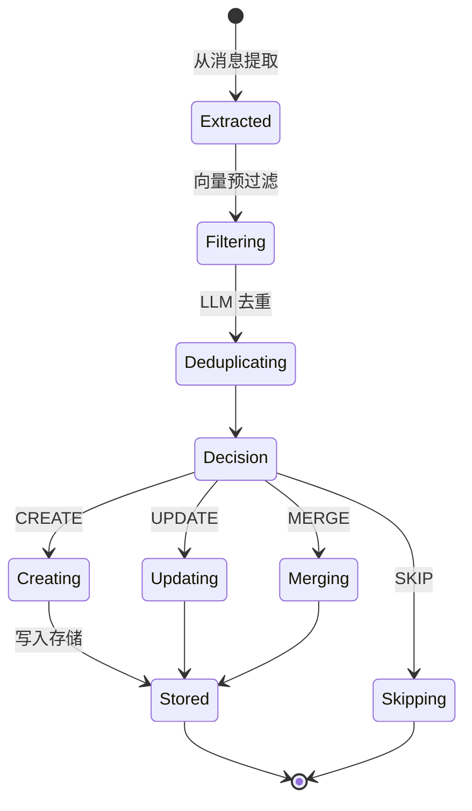

# OpenViking 技术原理图解

> 完整的技术原理与架构图解

## 目录

1. [整体架构](#1-整体架构)
2. [核心流程](#2-核心流程)
3. [模块关系](#3-模块关系)
4. [数据流向](#4-数据流向)
5. [状态机](#5-状态机)

---

## 1. 整体架构

### 1.1 系统架构全景图



---

## 2. 核心流程

### 2.1 资源添加流程



### 2.2 检索流程



### 2.3 会话提交流程

```mermaid
sequenceDiagram
    participant C as Client
    participant SeS as SessionService
    participant Msg as Message
    participant Comp as Compressor
    participant ME as MemoryExtractor
    participant VFS as VikingFS
    participant VB as VectorDB
    participant M as Model

    C->>SeS: session.commit()
    SeS->>Msg: get messages
    
    SeS->>Comp: compress(index)
    Comp->>VFS: archive messages
    Comp->>M: generate summary
    M-->>Comp: summary
    Comp->>VFS: write .abstract/.overview
    
    SeS->>ME: extract(messages)
    ME->>M: LLM extraction
    M-->>ME: candidate memories
    
    loop 去重决策
        ME->>VB: vector search
        VB-->>ME: similar memories
        ME->>M: LLM dedup decision
    end
    
    M-->>ME: decisions
    
    loop 处理每个记忆
        alt CREATE
            ME->>VFS: create memory
            ME->>VB: index
        alt UPDATE
            ME->>VFS: update memory
            ME->>VB: update vector
        alt MERGE
            ME->>VFS: merge memories
        end
    end
    
    SeS-->>C: result
```

---

## 3. 模块关系

### 3.1 模块依赖图



### 3.2 数据模型关系



---

## 4. 数据流向

### 4.1 写入数据流



### 4.2 读取数据流



---

## 5. 状态机

### 5.1 资源处理状态



### 5.2 会话状态



### 5.3 记忆更新状态



---

## 相关文档

- [项目概览](./01-项目概览与架构.md)
- [快速开始](./02-快速开始指南.md)
- [存储架构](./03-存储架构详解.md)
- [检索机制](./04-检索机制详解.md)
- [会话管理](./05-会话管理详解.md)
- [API 参考](./06-API参考.md)
- [部署指南](./07-部署指南.md)
- [最佳实践](./08-最佳实践.md)
