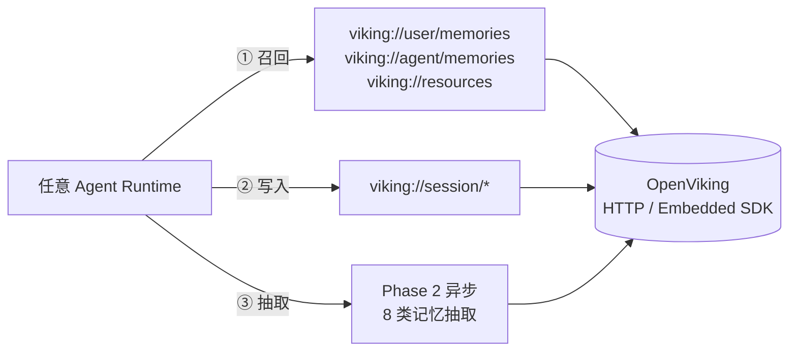
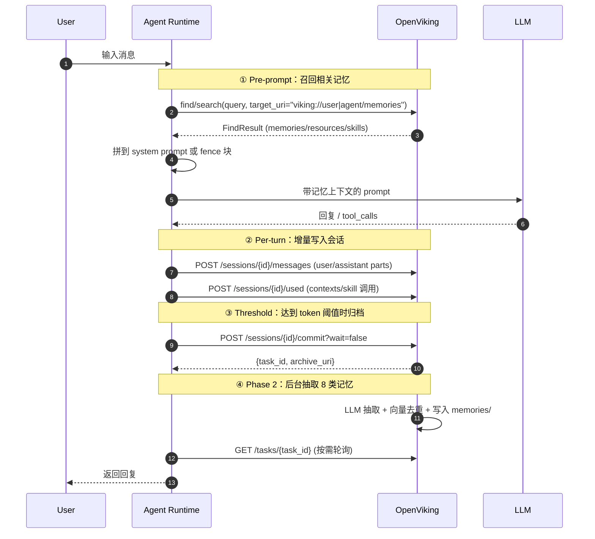
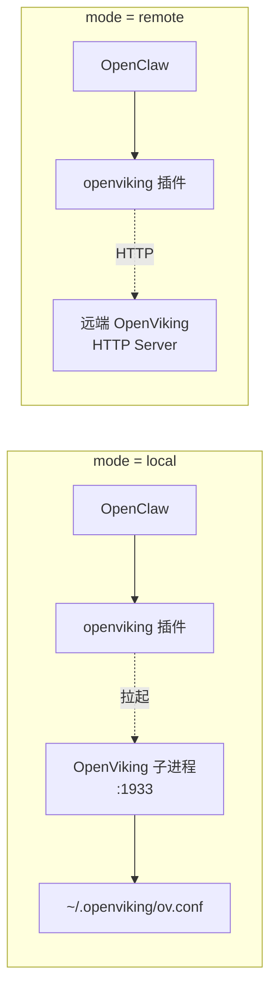
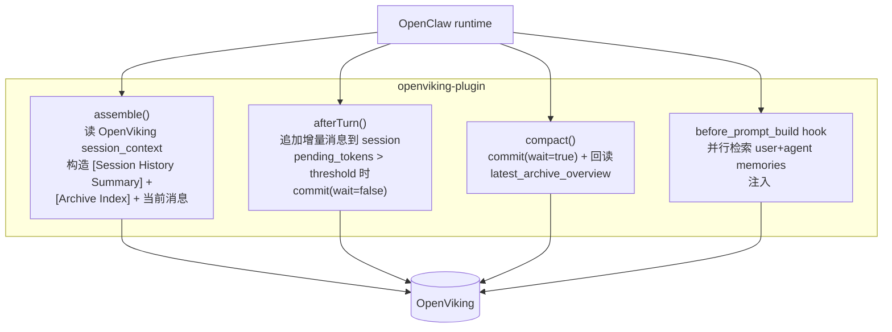
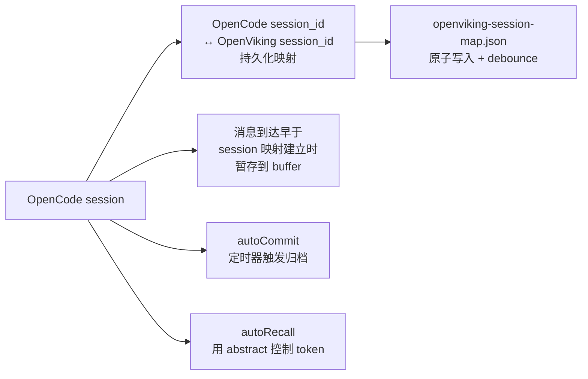
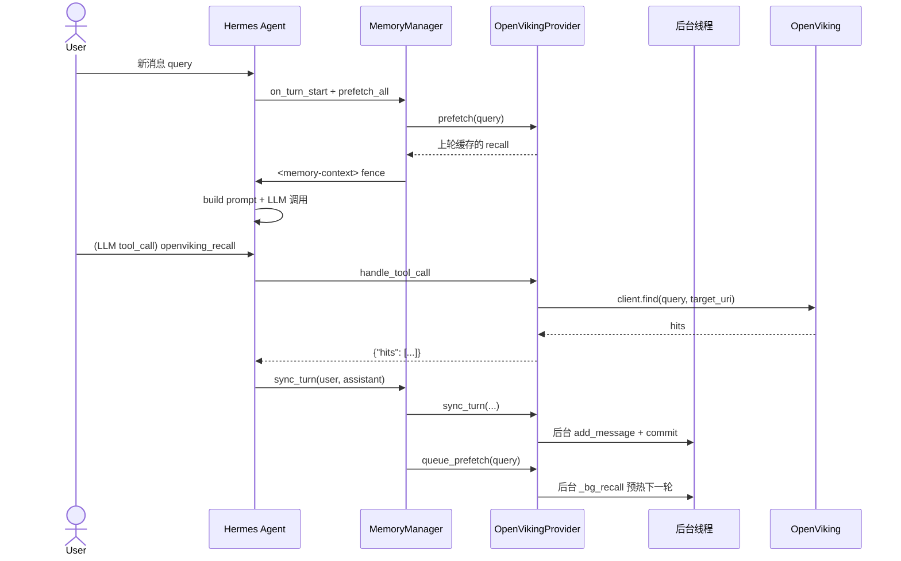

# OpenViking Agent 集成指南：把任意 Agent 接到 Context Database

> 把 OpenViking 用作 OpenClaw / OpenCode / Hermes 等 Agent 的"长期记忆 + 上下文引擎"
>
> 涉及代码：`OpenViking/examples/openclaw-plugin/`、`examples/opencode/plugin/`、`examples/opencode-memory-plugin/`、`bot/vikingbot/integrations/`、`openviking/server/routers/`

## 目录

1. [集成的本质：OpenViking 在 Agent Stack 里的位置](#1-集成的本质openviking-在-agent-stack-里的位置)
2. [统一集成模型：4 个挂载点](#2-统一集成模型4-个挂载点)
3. [OpenClaw：用现成 context-engine 插件](#3-openclaw用现成-context-engine-插件)
4. [OpenCode：两套官方插件](#4-opencode两套官方插件)
5. [Hermes：写一个 OpenVikingProvider](#5-hermes写一个-openvikingprovider)
6. [通用模式：用 Python SDK 或 HTTP 给任意 Agent 接入](#6-通用模式用-python-sdk-或-http-给任意-agent-接入)
7. [集成清单与排错](#7-集成清单与排错)

---

## 1. 集成的本质：OpenViking 在 Agent Stack 里的位置

不同 Agent 对"记忆"的命名不一样：

| Agent | 记忆/上下文抽象 | 接入方式 |
|---|---|---|
| **OpenClaw** | `context-engine` 插件槽位 | TS 插件，注册 4 类钩子 |
| **OpenCode** | `plugin` + `tool` 系统 | TS 插件，暴露工具 + skill |
| **Hermes** | `MemoryProvider` ABC（一主一从） | Python 子类，挂 `plugins/memory/openviking/` |
| **LangGraph / AutoGen / CrewAI** | 自定义 callback / memory adapter | 直接调 OpenViking SDK 或 HTTP |

但**它们看 OpenViking 的角度其实一样**——把 OpenViking 当作三件事的服务方：



**集成 = 把 Agent 的对话生命周期映射到 OpenViking 的三件事**。这就是后面所有形态背后唯一的内核。

---

## 2. 统一集成模型：4 个挂载点

无论用哪种 Agent，集成代码都会在以下 4 个时机出现。把这 4 个挂载点理解透，再看 OpenClaw / Hermes / OpenCode 的实现就只是"语法不同"。



| 挂载点 | 触发时机 | OpenViking API | 关键参数 |
|---|---|---|---|
| **① Pre-prompt 召回** | 每轮模型调用前 | `client.find()` 或 `POST /api/v1/search/find` | `query`、`target_uri`、`limit`、`score_threshold` |
| **② Per-turn 写入** | 每条 user/assistant 消息后 | `POST /api/v1/sessions/{id}/messages` | `role`、`parts: [TextPart\|ContextPart\|ToolPart]` |
| **③ 归档触发** | `pending_tokens > threshold` | `POST /api/v1/sessions/{id}/commit` | `wait`（false=异步、true=同步） |
| **④ 任务跟踪** | 模型需要确认抽取结果 | `GET /api/v1/tasks/{task_id}` | 看 `status`、`memories_extracted` |

> 这 4 个挂载点对应 `examples/openclaw-plugin/context-engine.ts` 中的 `assemble()`、`afterTurn()`、`compact()`，也对应 Hermes `MemoryProvider` 的 `prefetch()`、`sync_turn()`、`on_session_end()`。

---

## 3. OpenClaw：用现成 context-engine 插件

OpenViking 仓库自带 `examples/openclaw-plugin/`，这是当前**最完整**的 Agent 集成参考实现，扮演 4 个角色：`context-engine` + Hook 层 + Tool 提供者 + 本地 Runtime 管理器。

### 3.1 一键安装

```bash
# 推荐方式：通过 ClawHub 安装
openclaw plugins install clawhub:@openclaw/openviking

# 替代方式：通过 ov-install
npm install -g openclaw-openviking-setup-helper
ov-install
```

安装后跑一次配置向导：

```bash
openclaw openviking setup
```

它会做三件事：检测 Python 环境 → 验证 OpenViking 包 → 写配置到 `~/.openclaw/openclaw.json`。

### 3.2 Local vs Remote



| 配置项 | local | remote |
|---|---|---|
| `mode` | `local` | `remote` |
| `configPath` | `~/.openviking/ov.conf` | — |
| `port` | `1933`（本机端口） | — |
| `baseUrl` | — | `http://your-server:1933` |
| `apiKey` | — | OpenViking `root_api_key` 或 user key |
| `agentId` | `default`（建议起业务名） | 同左 |

切换示例：

```bash
# 切到 remote
openclaw config set plugins.entries.openviking.config.mode remote
openclaw config set plugins.entries.openviking.config.baseUrl http://your-server:1933
openclaw config set plugins.entries.openviking.config.apiKey your-api-key
openclaw config set plugins.entries.openviking.config.agentId my-agent-prod

# 重启网关
source ~/.openclaw/openviking.env && openclaw gateway restart
```

### 3.3 插件实际做了什么

阅读 `examples/openclaw-plugin/context-engine.ts` 时，重点看这三个函数与第 2 节的挂载点对应关系：



它额外暴露 6 个工具给 LLM：`memory_recall` / `memory_store` / `memory_forget` / `ov_archive_expand` / `ov_import` / `ov_search`，分别覆盖**显式召回、主动落记、按 URI 删除、归档原文展开、resource/skill 导入、统一搜索**。

### 3.4 命名空间策略（重要）

OpenViking PR #1356 之后，user/agent 路径展开由服务端 namespace policy 控制，插件**不再本地哈希**：

```text
viking://user/memories
  isolateUserScopeByAgent=false  →  viking://user/<user_id>/memories
  isolateUserScopeByAgent=true   →  viking://user/<user_id>/agent/<agent_id>/memories

viking://agent/memories
  isolateAgentScopeByUser=false  →  viking://agent/<agent_id>/memories
  isolateAgentScopeByUser=true   →  viking://agent/<agent_id>/user/<user_id>/memories
```

**插件配置必须和服务端 account namespace policy 一致**，否则会出现"recall 在不同 session 间不稳定"。

### 3.5 验证 + 排错

```bash
# 是否接管了 contextEngine 槽位
openclaw config get plugins.slots.contextEngine    # 应为 "openviking"

# 看 OpenClaw 日志
openclaw logs --follow                              # 看到 "openviking: registered context-engine"

# 看 OpenViking 日志
cat ~/.openviking/data/log/openviking.log

# 全链路健康检查（真发对话 + 验证捕获/抽取）
python examples/openclaw-plugin/health_check_tools/ov-healthcheck.py
```

---

## 4. OpenCode：两套官方插件

OpenViking 仓库给 OpenCode 提供了**两个**风味不同的插件，按你的需要二选一：

| 插件 | 路径 | 风格 | 适用场景 |
|---|---|---|---|
| **`opencode/plugin`** | `examples/opencode/plugin/` | 极简：注册 OpenViking SKILL，让 AI 自己用工具 | 想"加上代码仓库 RAG"，让 AI 自己处理 |
| **`opencode-memory-plugin`** | `examples/opencode-memory-plugin/` | 重型：会话映射、自动捕获、自动召回、定时 commit | 想要完整记忆系统，类似 OpenClaw 的体验 |

### 4.1 极简版（`opencode/plugin`）

OpenCode 已自带原生集成，只需三步：

**步骤 1**：跑起 OpenViking 服务

```bash
pip install openviking --upgrade
# 配好 ~/.openviking/ov.conf
openviking-server > /tmp/openviking.log 2>&1 &
```

**步骤 2**：注册插件

```jsonc
// ~/.config/opencode/opencode.json
{
  "plugin": ["openviking-opencode"]
}
```

**步骤 3**：聊天里直接用自然语言

```text
"将 https://github.com/tiangolo/fastapi 添加到 OpenViking"
"FastAPI 如何处理依赖注入？"
"使用 openviking 查找 JWT 令牌如何验证"
```

插件会装上若干 SKILL（来自 `examples/skills/ov-add-data/`、`ov-search-context/`、`ov-server-operate/`），AI 会自己组合调用。

### 4.2 重型版（`opencode-memory-plugin`）

它把第 2 节的 4 个挂载点全部实现了，配置文件 `openviking-config.json`：

```json
{
  "endpoint": "http://localhost:1933",
  "apiKey": "your-api-key-here",
  "enabled": true,
  "timeoutMs": 30000,
  "autoCommit": {
    "enabled": true,
    "intervalMinutes": 10
  },
  "autoRecall": {
    "enabled": true,
    "limit": 6,
    "scoreThreshold": 0.15,
    "maxContentChars": 500,
    "preferAbstract": true,
    "tokenBudget": 2000
  }
}
```

它额外做了几件别的插件没做的事：



> ⚠️ 注意：`opencode-memory-plugin` 内部使用了类似旧版的 `memories_extracted` 字段（一个老版本兼容字段）；新版 `commit()` 实际同步返回的是 `{status: "accepted", task_id, archive_uri}`，记忆抽取在后台 task 中完成。这一点在自定义集成里不要踩坑。

---

## 5. Hermes：写一个 OpenVikingProvider

Hermes 的记忆体系是**一主一从**：内置 `MEMORY.md/USER.md` 永远在线，外部最多挂一个 `MemoryProvider` 子类。Hermes 已自带 `plugins/memory/openviking/`（见 [Hermes 记忆框架解析](../hermess/memory-framework.md) 第 7 节）。

如果你想自己写一个或者 fork 改造，下面是**最小骨架**——只用 OpenViking 的 HTTP Server 模式，零额外依赖：

### 5.1 目录与注册

```
$HERMES_HOME/plugins/openviking_custom/
├── __init__.py
└── plugin.yaml   # 可选
```

`plugin.yaml`（可选，仅用于 UI 显示与依赖声明）：

```yaml
name: openviking_custom
version: 0.1.0
description: "OpenViking provider — 长期记忆 + 上下文数据库"
pip_dependencies:
  - openviking>=0.2.9
hooks:
  - prefetch
  - sync_turn
  - on_session_end
```

### 5.2 核心代码（90 行可用版）

```python
# $HERMES_HOME/plugins/openviking_custom/__init__.py
import json
import os
import threading
from typing import List, Dict, Any

from agent.memory_provider import MemoryProvider
import openviking as ov
from openviking.message import TextPart


class OpenVikingProvider(MemoryProvider):
    """把 OpenViking 接成 Hermes MemoryProvider。"""

    @property
    def name(self) -> str:
        return "openviking"

    def is_available(self) -> bool:
        return bool(os.getenv("OPENVIKING_BASE_URL"))

    def initialize(self, session_id: str, **kwargs):
        self._session_id = session_id
        self._client = ov.SyncHTTPClient(
            url=os.environ["OPENVIKING_BASE_URL"],
            api_key=os.getenv("OPENVIKING_API_KEY", ""),
        )
        self._client.initialize()
        self._cached_recall: str = ""
        self._lock = threading.Lock()

    def system_prompt_block(self) -> str:
        return (
            "You have OpenViking long-term memory. "
            "Use openviking_recall to fetch facts; new conversations are auto-archived."
        )

    def get_tool_schemas(self) -> List[Dict[str, Any]]:
        return [{
            "name": "openviking_recall",
            "description": "Recall facts from OpenViking long-term memory.",
            "parameters": {
                "type": "object",
                "properties": {
                    "query": {"type": "string"},
                    "scope": {"type": "string", "enum": ["user", "agent", "all"], "default": "all"},
                    "limit": {"type": "integer", "default": 6},
                },
                "required": ["query"],
            },
        }]

    def handle_tool_call(self, tool_name, args, **kwargs) -> str:
        if tool_name != "openviking_recall":
            return json.dumps({"error": "unknown tool"})
        target = {
            "user": "viking://user/memories",
            "agent": "viking://agent/memories",
            "all": "",
        }[args.get("scope", "all")]
        result = self._client.find(args["query"], target_uri=target, limit=args.get("limit", 6))
        hits = [
            {"uri": r.uri, "abstract": r.abstract, "score": r.score, "level": r.level}
            for r in (result.memories + result.resources)
        ]
        return json.dumps({"hits": hits}, ensure_ascii=False)

    def prefetch(self, query: str, *, session_id: str = "") -> str:
        with self._lock:
            return self._cached_recall

    def queue_prefetch(self, query: str, *, session_id: str = ""):
        threading.Thread(target=self._bg_recall, args=(query,), daemon=True).start()

    def _bg_recall(self, query: str):
        try:
            r = self._client.find(query, target_uri="viking://user/memories", limit=4)
            text = "\n".join(f"- {h.abstract}" for h in r.memories[:4])
            with self._lock:
                self._cached_recall = text
        except Exception:
            pass

    def sync_turn(self, user_content: str, assistant_content: str, *, session_id: str = ""):
        threading.Thread(
            target=self._bg_persist,
            args=(user_content, assistant_content, session_id or self._session_id),
            daemon=True,
        ).start()

    def _bg_persist(self, user_text: str, asst_text: str, session_id: str):
        try:
            sess = self._client.session(session_id=session_id)
            sess.add_message("user",      [TextPart(text=user_text)])
            sess.add_message("assistant", [TextPart(text=asst_text)])
            sess.commit()  # Phase 1 同步归档，Phase 2 后台抽取
        except Exception:
            pass


def register(ctx):
    ctx.register_memory_provider(OpenVikingProvider())
```

### 5.3 在 Hermes 中激活

```yaml
# Hermes config.yaml
memory:
  memory_enabled: true
  user_profile_enabled: true
  provider: openviking_custom    # ⚠️ 整个 Hermes 同一时刻只允许一个 external provider
```

```bash
export OPENVIKING_BASE_URL=http://127.0.0.1:1933
export OPENVIKING_API_KEY=your-user-key
hermes run
```

### 5.4 数据流（Hermes 视角）



> 关键设计：**`prefetch` 必须快进快出**——同步路径只读缓存，重活全部丢给后台线程；这是 Hermes 所有 Provider 的标准范式（参考 Honcho 的 `_prefetch_thread`、Mem0 的熔断器）。

---

## 6. 通用模式：用 Python SDK 或 HTTP 给任意 Agent 接入

如果你用的是 **LangChain / LangGraph / AutoGen / CrewAI / 自研 Agent**，没有现成插件——直接调 SDK 或 HTTP。这里给两套最小实现。

### 6.1 模式 A：嵌入式 SDK（同进程、零网络开销）

```python
import openviking as ov
from openviking.message import TextPart, ContextPart, ToolPart

class AgentMemoryAdapter:
    def __init__(self, agent_id: str, user_id: str, ov_path: str = "./data"):
        self.client = ov.OpenViking(path=ov_path)   # SyncOpenViking 同义
        self.client.initialize()
        self.agent_id = agent_id
        self.user_id = user_id
        self.session = None

    def start_turn(self, query: str) -> str:
        """① Pre-prompt 召回，返回拼好的 memory context 字符串。"""
        result = self.client.find(
            query,
            target_uri="viking://user/memories",
            limit=6,
            score_threshold=0.15,
        )
        if not result.memories:
            return ""
        lines = [f"- ({m.score:.2f}) {m.abstract}" for m in result.memories]
        return "<relevant-memories>\n" + "\n".join(lines) + "\n</relevant-memories>"

    def record_message(self, role: str, text: str, contexts: list[str] = None):
        """② Per-turn 写入。"""
        if self.session is None:
            self.session = self.client.session()
        self.session.add_message(role, [TextPart(text=text)])
        if contexts:
            self.session.used(contexts=contexts)

    def maybe_commit(self, force: bool = False):
        """③ 阈值 / 强制归档。"""
        if self.session is None:
            return
        result = self.session.commit()  # 同步 archive，后台抽 memory
        return result  # {task_id, archive_uri, ...}

    def wait_extracted(self, task_id: str, timeout: float = 30):
        """④ 任务跟踪（可选）。"""
        import time
        deadline = time.time() + timeout
        while time.time() < deadline:
            t = self.client.get_task(task_id)
            if t["status"] in ("completed", "failed"):
                return t
            time.sleep(1)
        return {"status": "timeout"}

    def close(self):
        self.client.close()
```

挂在任意 Agent 上：

```python
mem = AgentMemoryAdapter(agent_id="my-agent", user_id="alice")

def my_agent_loop(user_input: str) -> str:
    # ①
    memory_block = mem.start_turn(user_input)
    prompt = f"{memory_block}\n\nUser: {user_input}"

    # ② record user
    mem.record_message("user", user_input)

    # 你的 LLM 调用
    answer = call_llm(prompt)

    # ② record assistant
    mem.record_message("assistant", answer)

    # ③ 简单策略：每 5 轮归档一次
    if turn_counter % 5 == 0:
        mem.maybe_commit()

    return answer
```

### 6.2 模式 B：HTTP（跨语言、可分布式）

OpenViking Server 暴露的关键路由（来自 `openviking/server/routers/`）：

| 类别 | Method | Path | 作用 |
|---|---|---|---|
| 召回 | `POST` | `/api/v1/search/find` | 简单语义搜索 |
| 召回 | `POST` | `/api/v1/search/search` | 带会话/意图分析的复杂搜索 |
| 会话 | `POST` | `/api/v1/sessions` | 创建会话 |
| 会话 | `POST` | `/api/v1/sessions/{id}/messages` | 追加消息 |
| 会话 | `POST` | `/api/v1/sessions/{id}/used` | 记录使用的 context/skill |
| 会话 | `POST` | `/api/v1/sessions/{id}/commit` | 触发归档 + 抽取（Phase 1+2） |
| 会话 | `GET`  | `/api/v1/sessions/{id}/context` | 按 token 预算回读会话上下文 |
| 任务 | `GET`  | `/api/v1/tasks/{task_id}` | 跟踪 Phase 2 抽取状态 |
| 系统 | `GET`  | `/health`、`/ready`、`/api/v1/system/status` | 健康检查 |

最小 cURL 闭环：

```bash
BASE=http://localhost:1933
KEY=your-api-key

# 1. 召回
curl -s -X POST "$BASE/api/v1/search/find" \
  -H "Content-Type: application/json" \
  -H "X-API-Key: $KEY" \
  -d '{"query":"用户偏好","target_uri":"viking://user/memories","limit":6}'

# 2. 创建会话
SID=$(curl -s -X POST "$BASE/api/v1/sessions" \
  -H "X-API-Key: $KEY" -d '{}' | jq -r .session_id)

# 3. 追加消息
curl -s -X POST "$BASE/api/v1/sessions/$SID/messages" \
  -H "Content-Type: application/json" -H "X-API-Key: $KEY" \
  -d '{"role":"user","parts":[{"type":"text","text":"我想学 OpenViking"}]}'

curl -s -X POST "$BASE/api/v1/sessions/$SID/messages" \
  -H "Content-Type: application/json" -H "X-API-Key: $KEY" \
  -d '{"role":"assistant","parts":[{"type":"text","text":"先看快速开始指南..."}]}'

# 4. 提交（异步，后台抽记忆）
RESP=$(curl -s -X POST "$BASE/api/v1/sessions/$SID/commit?wait=false" \
  -H "X-API-Key: $KEY")
TASK=$(echo "$RESP" | jq -r .task_id)

# 5. 跟踪
curl -s "$BASE/api/v1/tasks/$TASK" -H "X-API-Key: $KEY"
```

> 推荐用 `X-API-Key` 头，**不要**用查询参数；`auth_mode=API_KEY` 时 user key 自动派生 user/account 身份。

### 6.3 LangGraph 接入示例

LangGraph 的典型挂载点是 `pre_model_hook` 和 `post_model_hook`。把 6.1 的 `AgentMemoryAdapter` 包成节点即可：

```python
from langgraph.graph import StateGraph, END

mem = AgentMemoryAdapter(agent_id="lg-agent", user_id="alice")

def recall_node(state):
    state["memory_block"] = mem.start_turn(state["input"])
    return state

def llm_node(state):
    prompt = f"{state['memory_block']}\n\nUser: {state['input']}"
    state["output"] = call_llm(prompt)
    return state

def persist_node(state):
    mem.record_message("user", state["input"])
    mem.record_message("assistant", state["output"])
    if state.get("turn", 0) % 5 == 0:
        mem.maybe_commit()
    return state

g = StateGraph(dict)
g.add_node("recall",  recall_node)
g.add_node("llm",     llm_node)
g.add_node("persist", persist_node)
g.add_edge("recall", "llm")
g.add_edge("llm", "persist")
g.add_edge("persist", END)
g.set_entry_point("recall")
app = g.compile()
```

> AutoGen 用 `register_function` + `before_send_message` 钩子；CrewAI 用 `Agent.memory_config` + 自定义 `MemoryStorage` —— 模式都是同一个，只是 API 名字不同。

---

## 7. 集成清单与排错

### 7.1 自检清单（任意 Agent 通用）

```mermaid
flowchart TD
    Start[开始集成] --> Step1{① 召回链路}
    Step1 -->|✗| F1[确认 BASE_URL/X-API-Key/<br/>target_uri 正确]
    Step1 -->|✓| Step2{② 写入链路}
    Step2 -->|✗| F2[确认 session_id 一致<br/>/messages parts 字段对]
    Step2 -->|✓| Step3{③ 归档链路}
    Step3 -->|✗| F3[确认 commit?wait=false<br/>返回 task_id]
    Step3 -->|✓| Step4{④ 抽取结果}
    Step4 -->|✗| F4[查 GET /tasks/{id}<br/>确认 status=completed]
    Step4 -->|✓| Done[集成完成]
```

| 阶段 | 验证命令 | 预期结果 |
|---|---|---|
| ① 召回 | `curl POST /api/v1/search/find` | `total >= 0`、无 401/422 |
| ② 写入 | 看 `GET /api/v1/sessions/{id}` | `message_count` 递增 |
| ③ 归档 | `commit?wait=false` | 返回 `archive_uri` 与 `task_id` |
| ④ 抽取 | `GET /api/v1/tasks/{task_id}` | `status=completed` 且 `memories_extracted > 0` |

### 7.2 常见坑

| 现象 | 真正原因 | 修复 |
|---|---|---|
| `find()` 总是空 | `target_uri` 为空字符串触发全局搜索，但向量索引尚未建好 | 先 `wait_processed()` 或显式 `target_uri` |
| 同 user 不同 session 召回不一致 | OpenClaw/Hermes 的 `agent_id` 和服务端 `isolateUserScopeByAgent` 不一致 | 对齐 namespace policy |
| `commit()` 返回 `archive_uri` 但记忆没出现 | 看的是 Phase 1 同步结果，Phase 2 还在跑 | `GET /tasks/{task_id}` 等到 `completed` |
| 写入消息丢失 | 直接传 `dict`，类型字段缺失 | 用 `parts: [{"type":"text","text":"..."}]` |
| 401 / API Key 不生效 | 用了 `Authorization: Bearer ...` | 应该用 `X-API-Key: ...` |
| 多租户互相串记忆 | `auth_mode=DEV` 时所有请求落在同一默认 user | 切到 `API_KEY` 模式，每用户一把 user key |
| `ToolPart` 写入异常 | 用了旧字段名 `name/input/output/success` | 必须 `tool_name/tool_input/tool_output/tool_status` |

### 7.3 调试入口

```bash
# 服务端整体状态
curl http://localhost:1933/api/v1/system/status

# 检索内部状态
curl http://localhost:1933/api/v1/observer/retrieval

# 向量库 scroll（debug 用）
curl 'http://localhost:1933/api/v1/debug/vector/scroll?limit=10'

# OpenClaw 链路
python OpenViking/examples/openclaw-plugin/health_check_tools/ov-healthcheck.py
```

---

## 8. 推荐路径

| 你的情况 | 推荐方案 |
|---|---|
| 用 OpenClaw | 直接装 `clawhub:@openclaw/openviking`，第 3 节 |
| 用 OpenCode 想要轻接入 | `examples/opencode/plugin/`，第 4.1 节 |
| 用 OpenCode 想要完整记忆 | `examples/opencode-memory-plugin/`，第 4.2 节 |
| 用 Hermes | 启用内置 `plugins/memory/openviking/` 或仿第 5 节自定义 |
| 用 LangGraph / AutoGen / CrewAI / 自研 | 嵌入式 SDK 走第 6.1 节；多语言/分布式走 6.2 节 HTTP |

集成完成后建议跟进阅读：

- [05-会话管理详解](./05-会话管理详解.md)：`commit()` 的 Phase 1 / Phase 2 细节
- [04-检索机制详解](./04-检索机制详解.md)：`find` vs `search` 的 intent analysis
- [07-部署指南](./07-部署指南.md)：`root_api_key` / `auth_mode` / namespace policy
- [08-最佳实践](./08-最佳实践.md)：成本控制、调试技巧、租户隔离

---

## 相关文档

- [项目概览与架构](./01-项目概览与架构.md)
- [快速开始指南](./02-快速开始指南.md)
- [API 参考](./06-API参考.md)
- [Hermes 记忆框架解析](../hermess/memory-framework.md)
